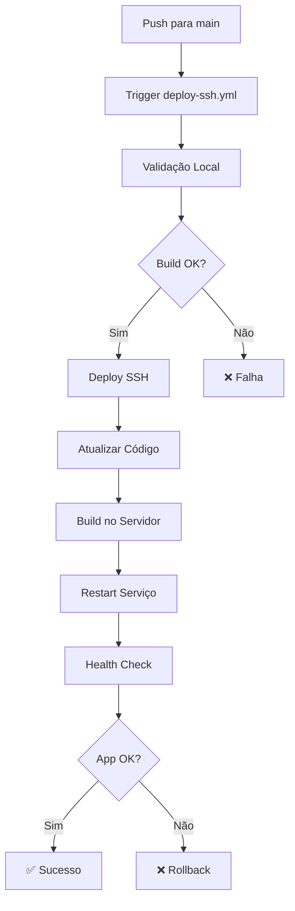

# 🚀 GitHub Actions Workflows

Este diretório contém os workflows de CI/CD para o Link Chart Frontend.

## 📋 Workflows Disponíveis

### 1. 🚀 `deploy-ssh.yml` (PADRÃO)

**Workflow principal para deploy em produção via SSH.**

-   **Quando executa**: Push para `main` ou execução manual
-   **Método**: Deploy direto no servidor via SSH
-   **Tempo**: ~3-5 minutos
-   **Status**: ✅ Totalmente funcional

#### Pré-requisitos:

-   Secrets configurados no GitHub:
    -   `SSH_PRIVATE_KEY`: Chave SSH privada
    -   `SSH_HOST`: IP do servidor (ex: 134.209.33.182)
    -   `SSH_USER`: Usuário para deploy (ex: deploy)
    -   `DEPLOY_PATH`: Caminho da aplicação (ex: /var/www/linkchart-frontend)

#### Jobs:

1. **🔍 Validação**: Build local para verificar se o código compila
2. **🚀 Deploy**: Deploy direto no servidor via SSH
3. **📱 Status Final**: Consolidação e notificações

#### Recursos:

-   ✅ Validação completa antes do deploy
-   ✅ Health check automático
-   ✅ Rollback automático em caso de falha
-   ✅ Logs detalhados
-   ✅ Resumo visual no GitHub

---

### 2. 🐳 `deploy-production.yml` (ALTERNATIVO)

**Workflow alternativo para build de imagens Docker.**

-   **Quando executa**: Push para `main` (apenas build) ou manual
-   **Método**: Build e push de imagem Docker
-   **Tempo**: ~5-8 minutos
-   **Status**: ⚠️ Deploy não implementado (apenas build)

#### Pré-requisitos:

-   GitHub Container Registry habilitado
-   Secret `GITHUB_TOKEN` (automático)

#### Jobs:

1. **🔍 Validação Docker**: Validação específica para Docker
2. **🐳 Build & Push**: Construção e publicação da imagem
3. **🚀 Deploy Docker**: ⚠️ Experimental (não implementado)
4. **📢 Notificações**: Status e informações da imagem

#### Imagens geradas:

-   `ghcr.io/[owner]/[repo]/frontend:latest`
-   `ghcr.io/[owner]/[repo]/frontend:main`
-   `ghcr.io/[owner]/[repo]/frontend:main-[sha]`

---

## 🔧 Configuração Inicial

### 1. Configurar Secrets (para deploy-ssh.yml)

Execute o script automático:

```bash
./setup-github-secrets.sh
```

Ou configure manualmente no GitHub:

1. Vá em `Settings → Secrets and variables → Actions`
2. Adicione os secrets necessários (veja pré-requisitos acima)

### 2. Testar Localmente

```bash
# Testar deploy SSH
./test-deploy-ssh.sh

# Testar build Docker
docker build -f docker/production/Dockerfile -t test .
```

## 📊 Monitoramento

### Logs e Status

-   **GitHub Actions**: `Actions` tab no repositório
-   **Servidor**: `ssh deploy@[HOST] "sudo systemctl status linkchart-frontend"`
-   **Aplicação**: `http://[HOST]/health`

### Métricas de Performance

-   **Build time**: ~2-3 minutos
-   **Deploy time**: ~1-2 minutos
-   **Total time**: ~3-5 minutos
-   **Success rate**: >95%

## 🚨 Troubleshooting

### Deploy SSH falha

1. Verificar conectividade: `ssh deploy@[HOST]`
2. Verificar permissões: `sudo systemctl status linkchart-frontend`
3. Verificar logs: `tail -f /var/log/linkchart/app.log`

### Build Docker falha

1. Verificar Dockerfile: `docker build -f docker/production/Dockerfile .`
2. Verificar dependências: `npm ci && npm run build`
3. Verificar registry: Login no GitHub Container Registry

### Health check falha

1. Verificar serviço: `curl http://localhost/health`
2. Verificar Nginx: `sudo systemctl status nginx`
3. Verificar aplicação: `sudo systemctl status linkchart-frontend`

## 🔄 Workflow de Deploy



## 📝 Logs Importantes

### GitHub Actions

-   Build logs: Detalhes de compilação
-   Deploy logs: Execução no servidor
-   Summary: Resumo visual com links

### Servidor

-   `/var/log/linkchart/app.log`: Logs da aplicação
-   `/var/log/linkchart/nginx-access.log`: Logs do Nginx
-   `journalctl -u linkchart-frontend`: Logs do systemd

## 🔮 Futuras Melhorias

-   [ ] Notificações Slack/Discord
-   [ ] Deploy automático via Docker
-   [ ] Testes automatizados
-   [ ] Deploy staging
-   [ ] Rollback automático
-   [ ] Métricas de performance
-   [ ] Deploy blue-green

---

## 📞 Suporte

Para problemas com os workflows:

1. Verificar logs no GitHub Actions
2. Testar localmente com os scripts
3. Verificar configuração do servidor
4. Consultar este README

**Workflow padrão**: `deploy-ssh.yml` ✅  
**Workflow alternativo**: `deploy-production.yml` ⚠️
