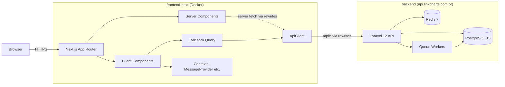

# Arquitetura geral

Browser → Next.js (App Router) → ApiClient → Laravel API → PostgreSQL/Redis. O front é stateless (sem DB próprio) e proxia toda chamada de domínio para o backend via `/api/*` rewrites configurados em `next.config.ts`. Server Components renderizam a casca da página e podem fazer fetch server-side (ex: `generateMetadata` em `/public-analytics/[slug]`); Client Components usam TanStack Query (estado de servidor) e contexts React (estado de UI — ex: `MessageProvider` para notificações) sobre o `ApiClient`.

A camada `ApiClient` (`src/lib/api/client.ts`) é o único ponto que conhece detalhes de transporte (JWT, envelope, normalização de erro). Todos os services estendem `BaseService` que delega ao `ApiClient`. Componentes nunca chamam `fetch` direto.

Em produção, o frontend é servido em `linkcharts.com.br` (deploy descrito no README raiz) e o backend em `api.linkcharts.com.br`. Em dev, os rewrites do Next apontam para `http://localhost:8000` — eliminando CORS.
