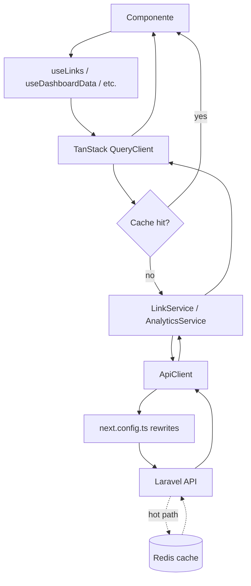

# Data fetching: TanStack Query + ApiClient

Componente cliente chama um hook (`useLinks`, `useDashboardData`, etc.). O hook consulta o cache do TanStack Query. Em miss, ele invoca um service (que estende `BaseService`), que delega ao `ApiClient`, que envia a request via `/api/*` (proxy do Next.js) ao backend Laravel. A resposta sobe pelo mesmo caminho com unwrap de envelope feito pelo `ApiClient` e cache atualizado pelo Query.

**Chaves de cache** vivem em `src/lib/query/keys.ts` e devem ser **sempre** importadas — nunca inline. Invalidação após mutation usa o mesmo factory (`queryClient.invalidateQueries({ queryKey: queryKeys.links.all() })`).

**Otimização `batch-meta`:** a página `/links` precisa de meta enriquecida (sparkline, trend, health, preview thumb) por link. Em vez de N requests por linha, há um único `POST /api/links/batch-meta` com a lista de IDs (hook `useLinksMeta(ids)` em `features/links/hooks`). Mantenha essa otimização — desfazer reduz UX da listagem em ~5x na latência de primeira pintura.
