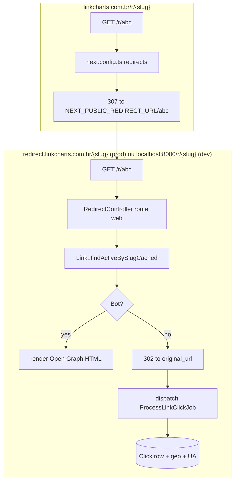

# Fluxo de redirect (`/r/{slug}`)

O domínio canônico de redirect é o **backend** (`api.linkcharts.com.br/r/{slug}` em prod, `localhost:8000/r/{slug}` em dev), rota `web.php`. Lá vive a lógica completa: detecção bot/humano, cache `findActiveBySlugCached`, increment denormalizado, dispatch do `ProcessLinkClickJob`, render Open Graph para bots ou 302 para humanos.

Hits em `linkcharts.com.br/r/{slug}` (domínio do app) são 307-redirected pelo `next.config.ts` para `${NEXT_PUBLIC_REDIRECT_URL}/{slug}`. O browser navega para o domínio canônico e o backend recebe o IP real para enriquecimento geo/UA.

**Zona crítica.** Mudanças exigem paridade bit-a-bit no backend em: tipo de redirect (302), status code, OG tags, ordem de tracking, tempo até disparo. O endpoint `/api/r/{slug}` (legado, AJAX) foi desativado em `routes/api.php` do backend (04/11/2025) — não reabrir.

O frontend não toma decisão de redirect além do 307 no `next.config.ts`. A página interstitial client-side (`app/(public)/r/[slug]/page.tsx` + `src/features/redirect/`) foi removida em 2026-05-11 porque bypassava o backend e não disparava `ProcessLinkClickJob` — cliques eram silenciosamente perdidos. Reintroduzi-la regride a observabilidade do produto.

Tracking sempre roda via job assíncrono (`ProcessLinkClickJob`) — o response HTTP do backend não espera o tracking terminar. Frontend e backend compartilham o mesmo schema de `clicks` no Postgres; mudanças no schema afetam `features/analytics` e `features/public-analytics`.
