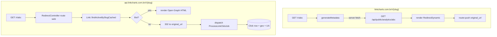

# Fluxo de redirect (`/r/{slug}`)

O domínio canônico de redirect é o **backend** (`api.linkcharts.com.br/r/{slug}`, rota `web.php`). Lá vive a lógica completa: detecção bot/humano, cache `findActiveBySlugCached`, increment denormalizado, dispatch do `ProcessLinkClickJob`, render Open Graph para bots ou 302 para humanos.

O front mantém uma rota espelho em `app/(public)/r/[slug]/page.tsx` para que URLs no domínio principal (`linkcharts.com.br/r/{slug}`) também resolvam. Esta rota usa `generateMetadata` (server-side) para popular Open Graph chamando `/api/public/analytics/{slug}`, e renderiza o componente `RedirectDynamic` (client) que faz o `router.push` para a `original_url`.

**Zona crítica.** Mudanças exigem paridade bit-a-bit em: tipo de redirect (302), status code, OG tags, ordem de tracking, tempo até disparo. O endpoint `/api/r/{slug}` (legado, AJAX) foi desativado em `routes/api.php` do backend (04/11/2025) — não reabrir.

Tracking sempre roda via job assíncrono (`ProcessLinkClickJob`) — o response HTTP do backend não espera o tracking terminar. Frontend e backend compartilham o mesmo schema de `clicks` no Postgres; mudanças no schema afetam `features/analytics` e `features/public-analytics`.
