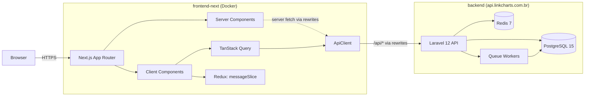
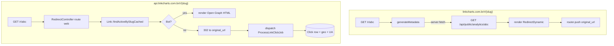
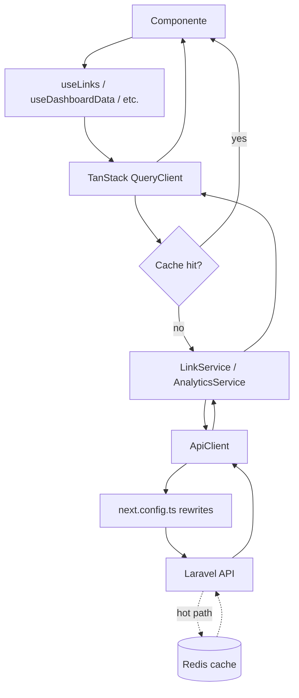

# Frontend Organization, Clarity Refactor & Documentation Plan

> **For agentic workers:** REQUIRED SUB-SKILL: Use superpowers:subagent-driven-development (recommended) or superpowers:executing-plans to implement this plan task-by-task. Steps use checkbox (`- [ ]`) syntax for tracking.

**Goal:** Bring the linkcharts frontend (`frontend-next/`) to a consolidated state where every feature is documented, naming/organization reflects the domain, and a new dev can ship a first PR without a human in the loop — preserving 100% of observable behavior.

**Architecture:** Eight ordered phases gated by `npm run quality` + Playwright (`auth.spec.ts`) and `git diff` review. Phase 1 (audit) is read-only. Phase 2 (refactor) blocks on human approval of the audit. Phases 3–8 (docs) only touch `.md` files and TSDoc comment blocks. Functional parity is the prime invariant.

**Tech Stack:** Next.js 15 App Router · React 19 · TypeScript strict · MUI 6 + Emotion · TanStack Query v5 · Redux Toolkit · React Hook Form + Zod · i18next · Playwright

---

## Conventions used in this plan

- **Working directory:** All `npm` and `git` commands assume cwd = `frontend-next/`. Commands prefix with `cd frontend-next` once at the top of each session.
- **Plan file location:** This file lives at `frontend-next/docs/superpowers/plans/2026-05-10-frontend-organization-and-docs.md`.
- **All paths in tasks are relative to `frontend-next/`** unless explicitly noted otherwise.
- **Commit style:** Conventional Commits (`type(scope): subject`), lowercase subject, no period, ≤72 chars. No `Co-Authored-By` trailers. No mention of AI tools.
- **Quality gate** (used between every task that changes files):
  - `npm run quality` → passes (type-check + lint + prettier:check)
  - `npx playwright test` → passes (only run when source code changed; doc-only commits can skip)
  - `git diff` → reviewed before commit

---

## Forbidden zones (NEVER touch in this work)

These are the "do not enter" signs from CLAUDE.md and the spec. If a task seems to require touching them, stop and report.

- `app/(public)/r/[slug]/page.tsx` — redirect dynamic route
- `src/features/redirect/components/RedirectDynamic.tsx`
- `app/(public)/r/[slug]/page.tsx`'s `generateMetadata`
- `middleware.ts` (security headers only — do not add auth there)
- `src/lib/auth/components/EmailVerificationGuard.tsx` (guard stays at layout level)
- The disabled `/api/r/{slug}` endpoint (do not reopen)

You may **document** these files (TSDoc, README mentions). You may **not** change their behavior.

---

## Pre-flight

### Task 0: Verify environment, read context, mark forbidden zones

**Files:**

- Read: `CLAUDE.md` (root)
- Read: `frontend-next/package.json`
- Read: `frontend-next/tsconfig.json`
- Read: `frontend-next/next.config.ts`
- Read: `frontend-next/eslint.config.mjs`
- Read: `frontend-next/playwright.config.ts`
- Read: `frontend-next/e2e/auth.spec.ts`

- [ ] **Step 1: Confirm both git repos**

```bash
cd /Users/bruno/Projects/link-charts
git status
cd frontend-next
git status
```

Expected: two independent repos. Note the current branch in `frontend-next/`.

- [ ] **Step 2: Establish baseline — quality gate must pass before any change**

```bash
cd frontend-next
npm install
npm run quality
```

Expected: type-check, lint, format:check all pass. If any fails, stop and report — the baseline is broken; do not start the work on top of failing gate.

- [ ] **Step 3: Establish baseline — Playwright must pass**

```bash
cd frontend-next
npx playwright install --with-deps  # only if first run on this machine
npx playwright test
```

Expected: `e2e/auth.spec.ts` passes. If it fails on a clean main, stop and report.

- [ ] **Step 4: Read the canonical context — make notes**

Read these files and confirm you understand each:

- `CLAUDE.md` (root)
- `frontend-next/package.json`
- `frontend-next/tsconfig.json` (note path aliases — they are the only legal import shorthand)
- `frontend-next/next.config.ts` (note `/api/*` rewrites to `API_URL`)
- `frontend-next/eslint.config.mjs`
- `frontend-next/playwright.config.ts`

No commit, no file change. Just read.

- [ ] **Step 5: List existing docs**

```bash
cd frontend-next
find docs -type f -name '*.md' 2>/dev/null
ls -la README.md CONTRIBUTING.md 2>/dev/null
```

Note which doc files already exist (so later phases know whether to create vs. overwrite).

---

## Phase 1 — Audit (read-only + 1 document)

**Goal:** Produce `docs/_audit/frontend-inventory.md` — a complete inventory of features, services, hooks, components, and routes, plus a refactor opportunity list and an orphan suspect list.

**Output:** `frontend-next/docs/_audit/frontend-inventory.md`

**No code changes. No file moves. No renames.**

### Task 1.1: Create inventory document skeleton

**Files:**

- Create: `docs/_audit/frontend-inventory.md`

- [ ] **Step 1: Create the docs/\_audit directory and the file with this exact skeleton**

```bash
mkdir -p docs/_audit
```

Write `docs/_audit/frontend-inventory.md` with this top-level structure:

```markdown
# Frontend Inventory — `frontend-next/`

> Snapshot date: 2026-05-10. Source: read-only inspection of `src/`, `app/`, and config files.
> Purpose: capture every domain unit exposed by the codebase, name what consumes it, and surface refactor opportunities. **No code changes are made by this document.**

## Conventions

- Path aliases (from `tsconfig.json`): `@/`, `@/features/*`, `@/lib/*`, `@/shared/*`, `@/auth/*`, `@/analytics/*`, `@/links/*`, `@/ui/*`, `@/layout/*`, `@/hooks/*`, `@/api/*`, `@/theme/*`, `@/store/*`, `@/utils/*`, `@/i18n/*`, `@/pages/*`.
- Backend domains are mapped via the `/api/*` proxy to `process.env.API_URL` (see `next.config.ts`).
- Query keys live in `src/lib/query/keys.ts`.

## 1. Features (`src/features/`)

(Filled by Tasks 1.2.x)

## 2. Services (`src/services/`)

(Filled by Task 1.3)

## 3. Shared hooks (`src/shared/hooks/`)

(Filled by Task 1.4)

## 4. Shared UI (`src/shared/ui/` and `src/shared/components/`)

(Filled by Task 1.4)

## 5. Lib (`src/lib/`)

(Filled by Task 1.5)

## 6. App routes (`app/`)

(Filled by Task 1.6)

## 7. Refactor opportunities

(Filled by Task 1.7)

## 8. Orphan suspects

(Filled by Task 1.8)
```

- [ ] **Step 2: Verify file exists**

```bash
ls -la docs/_audit/frontend-inventory.md
```

- [ ] **Step 3: Stage but do not commit yet** — Phase 1 is committed as a single doc at the end (Task 1.9).

### Task 1.2: Inventory each feature

**Files:**

- Modify: `docs/_audit/frontend-inventory.md` § 1

- [ ] **Step 1: For each subfolder of `src/features/` (analytics, links, profile, public-analytics, redirect, shorter), append a section with this exact template**

```markdown
### 1.X `src/features/<name>/`

**Index/barrel exports:** (from `<name>/index.ts`)

- `<symbolA>`
- `<symbolB>`

**Components:**

- `components/Foo.tsx` — 1-line purpose
- `components/Bar.tsx` — 1-line purpose

**Hooks (`hooks/`):**
| Hook | Type | Endpoint(s) consumed | Query key | Notes |
|------|------|----------------------|-----------|-------|
| `useThing` | useQuery | `GET /api/.../thing` | `queryKeys.foo.thing(id)` | one-line note |

**Services consumed:**

- `LinkService.findOne()` from `src/services/link.service.ts`

**Types (`types/`):**

- `link.ts` — `LinkResponse`, `LinkCreateRequest`, ...

**Utils (`utils/`):**

- `linkStatus.ts` — derives badge from expires_at/click_limit
```

- [ ] **Step 2: Cover every feature**

You must produce one section for **each** of these folders:

- `src/features/analytics/`
- `src/features/links/`
- `src/features/profile/`
- `src/features/public-analytics/`
- `src/features/redirect/`
- `src/features/shorter/`

For each, read the actual `index.ts`, every file under `hooks/`, and the immediate component files. Cross-reference any service it imports.

- [ ] **Step 3: Verify completeness**

```bash
grep -c '^### 1\.' docs/_audit/frontend-inventory.md
```

Expected: `6` (one per feature). If less, identify which feature is missing and add it.

### Task 1.3: Inventory services and map to backend

**Files:**

- Modify: `docs/_audit/frontend-inventory.md` § 2

- [ ] **Step 1: For each file in `src/services/`, append a row to a table with this format**

```markdown
## 2. Services (`src/services/`)

| File                     | Class               | Methods                                                               | Endpoints (REST)                                                                                                                                                                                                                                  | Backend domain (Laravel)                                                                         |
| ------------------------ | ------------------- | --------------------------------------------------------------------- | ------------------------------------------------------------------------------------------------------------------------------------------------------------------------------------------------------------------------------------------------- | ------------------------------------------------------------------------------------------------ | -------- | -------- | -------- | -------------- | ------------------------------------------------ |
| `base.service.ts`        | `BaseService`       | `get/post/put/delete`                                                 | (uses ApiClient)                                                                                                                                                                                                                                  | (n/a — abstract)                                                                                 |
| `auth.service.ts`        | `AuthService`       | `signIn/signUp/signOut/getMe/...`                                     | `/api/auth/login`, `/api/auth/register`, `/api/me`, `/api/profile`, `/api/change-password`, `/api/auth/verify-email`, `/api/auth/forgot-password`, `/api/auth/reset-password`, `/api/email-verification-status`, `/api/resend-verification-email` | `Http/Controllers/Auth/AuthController`                                                           |
| `link.service.ts`        | `LinkService`       | `save/update/all/findOne/remove/getAnalytics/getClicksList`           | `/api/links`, `/api/links/{id}`, `/api/links/{id}/analytics`, `/api/link/{id}/clicks-list`                                                                                                                                                        | `Http/Controllers/Links/LinkController`                                                          |
| `link-meta.service.ts`   | `LinkMetaService`   | `batchMeta`                                                           | `/api/links/batch-meta`                                                                                                                                                                                                                           | `Http/Controllers/Links/LinkController` (or sibling — verify)                                    |
| `link-public.service.ts` | `PublicLinkService` | `createPublicLink/getLinkBySlug/getPublicAnalytics/validateUrl/...`   | `/api/public/links`, `/api/public/analytics/{slug}` (verify exact paths in source)                                                                                                                                                                | `Http/Controllers/Links/PublicLinkController` + `Http/Controllers/Analytics/AnalyticsController` |
| `analytics.service.ts`   | `AnalyticsService`  | `getAnalytics/getLinkAnalytics/getLinkGeographicData/getLinkInsights` | `/api/analytics/...`, `/api/analytics/link/{id}/dashboard                                                                                                                                                                                         | geographic                                                                                       | temporal | audience | insights | comprehensive` | `Http/Controllers/Analytics/AnalyticsController` |
| `profile.service.ts`     | `ProfileService`    | `getCurrentUser/updateProfile`                                        | `/api/me`, `/api/profile`                                                                                                                                                                                                                         | `Http/Controllers/Auth/AuthController`                                                           |
| `index.ts`               | (barrel)            | (n/a)                                                                 | (n/a)                                                                                                                                                                                                                                             | (n/a)                                                                                            |
```

The endpoint cells are **verified by reading each service file**, not guessed. If a service hits an endpoint not in this table, add it. If a path differs (e.g., `/api/public/links` vs `/api/public-links`), correct it from the actual code.

- [ ] **Step 2: Cross-check against `src/lib/api/endpoints.ts`**

The `API_CONFIG.ENDPOINTS` constant is the canonical list. Open it and confirm every path used in services appears there (or note any direct string concatenation in a service as a small consistency issue under § 7).

### Task 1.4: Inventory shared hooks, UI components, and shared components

**Files:**

- Modify: `docs/_audit/frontend-inventory.md` § 3 and § 4

- [ ] **Step 1: § 3 — Shared hooks table**

For each file in `src/shared/hooks/`, append one row (1-line purpose):

```markdown
## 3. Shared hooks (`src/shared/hooks/`)

| Hook file               | Purpose                      |
| ----------------------- | ---------------------------- |
| `useClipboard.ts`       | (read file → 1-line purpose) |
| `useDebounce.ts`        | (read file → 1-line purpose) |
| `useLocation.ts`        | (read file → 1-line purpose) |
| `useNavigate.ts`        | (read file → 1-line purpose) |
| `usePathname.ts`        | (read file → 1-line purpose) |
| `useSearchParams.ts`    | (read file → 1-line purpose) |
| `useThemeMediaQuery.ts` | (read file → 1-line purpose) |
| `hooks.ts`              | (read file → 1-line purpose) |
```

- [ ] **Step 2: § 4 — Shared UI inventory**

```markdown
## 4. Shared UI

### `src/shared/ui/base/`

| File                        | Purpose  |
| --------------------------- | -------- |
| `AnalyticsStateManager.tsx` | (1-line) |
| `AppLogo.tsx`               | (1-line) |
| `ChartCard.tsx`             | (1-line) |
| `EmptyState.tsx`            | (1-line) |
| `EnhancedPaper.tsx`         | (1-line) |
| `GradientButton.tsx`        | (1-line) |
| `MetricCardOptimized.tsx`   | (1-line) |
| `PageHeader.tsx`            | (1-line) |
| `ResponsiveContainer.tsx`   | (1-line) |
| `SafeTypography.tsx`        | (1-line) |
| `TabDescription.tsx`        | (1-line) |
| `TabPanel.tsx`              | (1-line) |

### `src/shared/ui/data-display/`

| File                             | Purpose                                                                  |
| -------------------------------- | ------------------------------------------------------------------------ |
| `ApexChartWrapper.tsx`           | (1-line)                                                                 |
| `ApexChartWrapper.styled.tsx`    | (1-line)                                                                 |
| `ChartCard.tsx`                  | (1-line — note: there is also `base/ChartCard.tsx`; flag overlap in § 7) |
| `DataTable.tsx`                  | (1-line)                                                                 |
| `DataTableTopToolbar.tsx`        | (1-line)                                                                 |
| `utils/parseFromValuesOrFunc.ts` | (1-line)                                                                 |

### `src/shared/ui/feedback/`

| File                                    | Purpose  |
| --------------------------------------- | -------- |
| `EmailVerificationBanner.tsx`           | (1-line) |
| `Loading.tsx`                           | (1-line) |
| `Message.tsx`                           | (1-line) |
| `skeletons/LinkFormSkeleton.tsx`        | (1-line) |
| `skeletons/LinkListSkeleton.tsx`        | (1-line) |
| `skeletons/PageLoadingSkeleton.tsx`     | (1-line) |
| `skeletons/ProfileSkeleton.tsx`         | (1-line) |
| `skeletons/PublicAnalyticsSkeleton.tsx` | (1-line) |
| `skeletons/QRCodeSkeleton.tsx`          | (1-line) |

### `src/shared/ui/icons/`

| File          | Purpose  |
| ------------- | -------- |
| `AppIcon.tsx` | (1-line) |
| `AppIcons.ts` | (1-line) |
| `SvgIcon.tsx` | (1-line) |

### `src/shared/ui/navigation/`

| File                 | Purpose  |
| -------------------- | -------- |
| `Link.tsx`           | (1-line) |
| `PageBreadcrumb.tsx` | (1-line) |

### `src/shared/ui/patterns/`

| File               | Purpose  |
| ------------------ | -------- |
| `FormActions.tsx`  | (1-line) |
| `TableActions.tsx` | (1-line) |

### `src/shared/components/`

| File                       | Purpose  |
| -------------------------- | -------- |
| `CookieConsentInit.tsx`    | (1-line) |
| `ads/AdSlot.tsx`           | (1-line) |
| `cta/SignUpCtaCard.tsx`    | (1-line) |
| `routing/HomeRedirect.tsx` | (1-line) |

### `src/shared/layout/`

| File                             | Purpose  |
| -------------------------------- | -------- |
| `AuthLayout.tsx`                 | (1-line) |
| `BenefitsSection.tsx`            | (1-line) |
| `ErrorLayout.tsx`                | (1-line) |
| `HeroSection.tsx`                | (1-line) |
| `LoadingWithRedirect.tsx`        | (1-line) |
| `MainLayout.tsx`                 | (1-line) |
| `PublicLayout.tsx`               | (1-line) |
| `components/Footer.tsx`          | (1-line) |
| `components/Navbar.tsx`          | (1-line) |
| `core/Layout.tsx`                | (1-line) |
| `core/LayoutProvider.tsx`        | (1-line) |
| `core/LayoutSettingsContext.tsx` | (1-line) |
| `core/useLayoutSettings.tsx`     | (1-line) |
```

Each "(1-line)" placeholder is filled by reading the file. **Do not leave any literal `(1-line)` in the final document** — that is a plan failure.

### Task 1.5: Inventory `src/lib/` subfolders

**Files:**

- Modify: `docs/_audit/frontend-inventory.md` § 5

- [ ] **Step 1: For each subfolder of `src/lib/`, append a subsection**

```markdown
## 5. Lib (`src/lib/`)

### 5.1 `lib/api/`

- `client.ts` — `ApiClient` class. Public surface: `get/post/put/patch/delete/postForm/upload`. Handles JWT injection from `localStorage.token`, envelope unwrap (`{data, meta?, message?}`), error normalization (`{error: {code, message, details?}}`).
- `endpoints.ts` — `API_CONFIG.ENDPOINTS` constant; canonical list of REST paths and `HTTP_STATUS` codes.

### 5.2 `lib/query/`

- `client.ts` — TanStack Query `QueryClient` factory and default options.
- `keys.ts` — `queryKeys` factory: `links.{all,list,detail,meta}`, `analytics.{temporal,geographic,audience,insights,public,publicLink}`. (Note: dashboard hook may key under `analytics.<id>.dashboard`; verify against `useDashboardData.ts` and add to keys.ts if missing.)

### 5.3 `lib/store/` (Redux Toolkit)

- `store.ts` — store factory with lazy-loaded slices.
- `rootReducer.ts` — `combineSlices` + `LazyLoadedSlices` interface.
- `messageSlice.ts` — global notifications (used by Notistack-bridged Message component).
- `middleware.ts` — custom middleware (read file for actual purpose).
- `hooks.ts` — typed `useAppDispatch`, `useAppSelector`.

### 5.4 `lib/auth/`

- `AuthContext.tsx` — `AuthProvider` + `useAuth` (user, isAuthenticated, login, logout, updateUser, refreshUser).
- `useUser.tsx` — `useUser` wrapper (data, isGuest, signOut, refreshUser).
- `AuthGuardRedirect.tsx` — (read file for purpose).
- `authApi.ts` — (read file for purpose).
- `authRoles.ts` — (read file for purpose).
- `components/EmailVerificationGuard.tsx` — guards (app)/\* layout — REDIRECTS unverified to `/email-verification-pending`.
- `forms/AuthJsForm.tsx` — generic auth form scaffolding (used by SignIn/SignUp/etc.).
- `forms/authFieldStyles.ts` — shared MUI sx for auth form fields.
- `forms/signinErrors.ts` — error code → user message map.
- `sessionRedirectUrl.ts` — post-login redirect URL helper.

### 5.5 `lib/i18n/`

- `config.ts` — `initI18n()` and `detectAndApplyLanguage()`.
- `index.ts` — barrel.
- `types.ts` — typed translation namespaces.
- `components/LanguageSelector.tsx` — UI to switch language.
- `hooks/useLanguage.ts` — language state hook.
- `locales/{en,pt-BR}/{analytics,auth,common,links,profile,public}.json` — translation files.

### 5.6 `lib/theme/`

(Tree summary — full per-file purpose deferred to Phase 4 README; here just structure.)

- `MainThemeProvider.tsx`, `index.ts`, `designSystem.ts`, `globalStyles.ts`, `iconDefaults.ts`, `colors/{chart,dark,light,semantic,index}.ts`, `config/{index,muiComponents,optimizedSettings}.ts`, `hooks/{fuseThemeHooks,useChartHeight,useResponsive,index}.ts`, `types/{index,theme}.ts`, `utils/{animationUtils,chartColorUtils,colorUtils,gradientUtils,responsiveUtils,shadowUtils,spacingUtils,index}.ts`.

### 5.7 `lib/utils/`

- `ErrorBoundary.tsx` — top-level error boundary.
- `authUtils.ts` — (read file for purpose).
- `shortUrl.ts` — short URL building / parsing.
- `index.ts` — barrel.

### 5.8 `lib/providers/`

- `Providers.tsx` — composes `QueryClientProvider`, Redux `Provider`, `AuthProvider`, `MainThemeProvider`, `i18n`, `SnackbarProvider`.

### 5.9 `lib/seo/`

- `structuredData.ts` — JSON-LD helpers.

### 5.10 `lib/ads/`

- `components/GoogleAd.tsx`, `components/GoogleAdsSpace.tsx` — ad slot components.
- `config/adsConfig.ts` — slot id / size config.
- `hooks/useGoogleAds.ts` — load/refresh hook.

### 5.11 `lib/consent/`

- `cookie-consent.ts` — consent management init.
- `cookieconsent.esm.js` — vendored vanilla-cookieconsent (excluded from ESLint).

### 5.12 `lib/AppContext.ts` and `lib/settingsConfig.ts`

- (Read each file and add 1-line purpose.)
```

Replace each `(read file for purpose)` with the actual one-line purpose. Do not leave literal placeholder text.

### Task 1.6: Map `app/` routes to features and guards

**Files:**

- Modify: `docs/_audit/frontend-inventory.md` § 6

- [ ] **Step 1: Append the route map**

```markdown
## 6. App routes (`app/`)

### 6.1 Root

- `app/layout.tsx` — root HTML, metadata, providers (`Providers.tsx`), Google Analytics, scripts.
- `app/page.tsx` — `HomeRedirect` component (auth-aware home → `/links` or `/shorter`).
- `app/loading.tsx`, `app/error.tsx`, `app/global-error.tsx` — root loading and error boundaries.
- `app/not-found.tsx` — 404 (renders `page-components/system/NotFoundPage.tsx`).
- `app/401/page.tsx` — 401 (renders `page-components/system/UnauthorizedPage.tsx`).
- `app/manifest.ts`, `app/robots.ts`, `app/sitemap.ts` — Next.js metadata routes.
- `app/api/health/route.ts` — health-check API route (frontend-internal, takes precedence over rewrites).
- `app/api/check-url/route.ts` — server-side URL safety check (uses `GOOGLE_SAFE_BROWSING_KEY`).

### 6.2 `(app)` group — authenticated

**Layout:** `app/(app)/layout.tsx` wraps with `MainLayout` + `EmailVerificationGuard`.
**Guard:** `EmailVerificationGuard` (client-side). Layout-level loading/error: `loading.tsx`, `error.tsx`.

| Route                   | Page component                            | Feature consumed                             |
| ----------------------- | ----------------------------------------- | -------------------------------------------- |
| `/analytics`            | `app/(app)/analytics/page.tsx`            | `features/analytics` (multi-link summary)    |
| `/links`                | `app/(app)/links/page.tsx`                | `features/links` (list)                      |
| `/links/create`         | `app/(app)/links/create/page.tsx`         | `features/links` (create)                    |
| `/links/edit/[id]`      | `app/(app)/links/edit/[id]/page.tsx`      | `features/links` (edit)                      |
| `/links/analytics/[id]` | `app/(app)/links/analytics/[id]/page.tsx` | `features/analytics` (single-link dashboard) |
| `/links/qr/[id]`        | `app/(app)/links/qr/[id]/page.tsx`        | `features/links` (QR rendering)              |
| `/profile`              | `app/(app)/profile/page.tsx`              | `features/profile`                           |

### 6.3 `(auth)` group — unauthenticated forms

**Layout:** `app/(auth)/layout.tsx` (no MainLayout chrome).

| Route                         | Page component                                   | Feature consumed                                              |
| ----------------------------- | ------------------------------------------------ | ------------------------------------------------------------- |
| `/sign-in`                    | `app/(auth)/sign-in/page.tsx`                    | `page-components/auth/SignInPage.tsx` (uses `lib/auth/forms`) |
| `/sign-up`                    | `app/(auth)/sign-up/page.tsx`                    | `page-components/auth/SignUpPage.tsx`                         |
| `/sign-out`                   | `app/(auth)/sign-out/page.tsx`                   | `page-components/auth/SignOutPage.tsx`                        |
| `/forgot-password`            | `app/(auth)/forgot-password/page.tsx`            | `page-components/auth/ForgotPasswordPage.tsx`                 |
| `/reset-password`             | `app/(auth)/reset-password/page.tsx`             | `page-components/auth/ResetPasswordPage.tsx`                  |
| `/verify-email`               | `app/(auth)/verify-email/page.tsx`               | `page-components/auth/VerifyEmailPage.tsx`                    |
| `/email-verification-pending` | `app/(auth)/email-verification-pending/page.tsx` | `page-components/auth/EmailVerificationPendingPage.tsx`       |

### 6.4 `(public)` group — anonymous-accessible

**Layout:** `app/(public)/layout.tsx`.

| Route                      | Page component                                                                         | Feature consumed                         |
| -------------------------- | -------------------------------------------------------------------------------------- | ---------------------------------------- |
| `/shorter`                 | `app/(public)/shorter/page.tsx` + `ShorterClientPage.tsx`                              | `features/shorter`                       |
| `/r/[slug]`                | `app/(public)/r/[slug]/page.tsx` (`generateMetadata` server fetch + `RedirectDynamic`) | `features/redirect` — **FORBIDDEN ZONE** |
| `/public-analytics/[slug]` | `app/(public)/public-analytics/[slug]/page.tsx`                                        | `features/public-analytics`              |
| `/privacy`                 | `app/(public)/privacy/page.tsx`                                                        | (static)                                 |
| `/support`                 | `app/(public)/support/page.tsx`                                                        | (static)                                 |
| `/terms`                   | `app/(public)/terms/page.tsx`                                                          | (static)                                 |

### 6.5 Middleware

- `middleware.ts` — security headers only. **FORBIDDEN ZONE** (do not extend).
```

### Task 1.7: List refactor opportunities with risk levels

**Files:**

- Modify: `docs/_audit/frontend-inventory.md` § 7

- [ ] **Step 1: Append the refactor opportunities section**

While reading the codebase for sections 1–6, you will have noticed naming/organization inconsistencies. Capture them here. **Do NOT change any code at this stage** — this is a proposal.

Mandatory format for each entry:

```markdown
## 7. Refactor opportunities

### 7.1 Risk: low (rename/move local helpers, no public API impact)

- [ ] **R-LOW-1:** `<from>` → `<to>` — _Why:_ (1 line)
- [ ] **R-LOW-2:** ...

### 7.2 Risk: medium (file move between folders, multiple call-site updates)

- [ ] **R-MED-1:** Move `<from>` → `<to>` — _Why:_ (1 line). _Call-site count:_ (estimate from grep)
- [ ] **R-MED-2:** ...

### 7.3 Risk: high (touches a forbidden zone or critical path)

> Items here are **not eligible** for Phase 2 in this work. They are documented for future planning.

- [ ] **R-HIGH-1:** ...
```

**Rules:**

- A renaming inside one file = `low`.
- A move between folders that needs all imports updated = `medium`.
- Anything touching forbidden zones, or anything where you cannot fully enumerate call sites = `high`.

**Suggested candidates to evaluate** (verify each by inspecting the code; only include if genuinely worth doing):

- `src/shared/ui/base/ChartCard.tsx` and `src/shared/ui/data-display/ChartCard.tsx` — same name, different files. Verify whether they have overlapping responsibility; if yes, propose consolidation (medium).
- `src/features/profile/types/UserModel.ts` vs `user.ts` vs `api.ts` — three type files for one feature. Propose consolidation if they overlap (medium).
- `src/lib/AppContext.ts` (single file at `lib/` root) — flag whether it belongs in a subfolder (low/medium).
- `src/lib/settingsConfig.ts` (single file at `lib/` root) — same as above.
- `src/shared/hooks/hooks.ts` — generic file name; verify what it exports and propose a clearer name if appropriate (low).
- `src/features/shorter/hooks/index.ts` — verify whether the barrel adds value or merely re-exports `useShorter` (low).
- `src/features/profile/components/styles/Profile.styled.tsx` — single styles file in a `styles/` folder; check pattern consistency vs other features (low).

For each candidate you keep, complete the _Why_ and _Call-site count_ fields by running `grep` to estimate impact:

```bash
grep -r 'from .*ChartCard' src --include='*.ts' --include='*.tsx' | wc -l
```

### Task 1.8: List orphan suspects (do not delete)

**Files:**

- Modify: `docs/_audit/frontend-inventory.md` § 8

- [ ] **Step 1: For each export that has zero call sites, list it. Do not remove it.**

```markdown
## 8. Orphan suspects

> These exports have **no detected import sites in `src/` or `app/`**. They may still be referenced indirectly (dynamic imports, JSON-driven dispatch, test fixtures). DO NOT remove. Mark with `// TODO(orphan?):` only if you are 100% sure they are unused.

| Symbol     | File     | Detection method                                                               |
| ---------- | -------- | ------------------------------------------------------------------------------ |
| `<symbol>` | `<path>` | `grep -r 'from .<file>' src app` returned 0 results other than the file itself |
```

**Detection commands:**

```bash
# For a function or hook foo:
grep -rn 'foo' src app --include='*.ts' --include='*.tsx' | grep -v ':\s*//' | grep -v 'foo[ \t]*=\|export.*foo'
```

If grep finds zero usages outside the defining file, list it here. Verify each candidate manually — false positives are common when a symbol is dynamically referenced.

### Task 1.9: Quality gate, commit, request approval

- [ ] **Step 1: Verify the doc has no literal placeholder leakage**

```bash
grep -nE '\(read file|TBD|TODO\(plan\)|\(1-line\)' docs/_audit/frontend-inventory.md
```

Expected: zero matches. Any match means a placeholder was not filled in — fix and re-run.

- [ ] **Step 2: Run quality gate**

```bash
npm run quality
```

Expected: passes (the doc change is `.md` only — no source files touched).

- [ ] **Step 3: Skip Playwright (no source code changed)**

Note in commit message that no source change → no E2E run needed.

- [ ] **Step 4: Review the diff**

```bash
git diff -- docs/_audit/
git status
```

Expected: only files under `docs/_audit/` are added or modified. **If anything else changed, stop and report — Phase 1 is read-only outside this folder.**

- [ ] **Step 5: Commit**

```bash
git add docs/_audit/frontend-inventory.md
git commit -m "docs(audit): add frontend inventory and refactor proposals"
```

- [ ] **Step 6: Report and wait for approval**

Output to the user:

> Phase 1 complete. `docs/_audit/frontend-inventory.md` lists every feature, service, hook, component, and route, plus N refactor opportunities (X low, Y medium, Z high) and M orphan suspects.
>
> **Required before Phase 2:** approve or reject each item in § 7 (use the checkbox in front of each `R-LOW-X` / `R-MED-X` / `R-HIGH-X`).
>
> Paridade funcional preservada — nenhuma funcionalidade adicionada ou removida nesta fase.

---

## CHECKPOINT — Wait for human approval before Phase 2

The implementing agent must **stop here** until the user replies with the approved refactor list. Do not start Phase 2 on assumed approvals.

---

## Phase 2 — Clarity refactors (only approved items)

**Goal:** Apply the user-approved refactors from § 7 of the audit, one commit per item, with all call sites updated.

**Inputs (from approval message):**

- Approved IDs (e.g., `R-LOW-1, R-LOW-3, R-MED-2`).
- Anything not approved → skip.

**Iteration template** (used once per approved item):

### Task 2.X: Apply refactor `R-<RISK>-<N>`

**Files:**

- Modify: (depends on item — enumerate all files touched)

- [ ] **Step 1: Re-read the item description in `docs/_audit/frontend-inventory.md` § 7**

Confirm scope. If the description is ambiguous, stop and ask the user before touching code.

- [ ] **Step 2: Enumerate all call sites**

```bash
grep -rn '<symbol-or-path>' src app --include='*.ts' --include='*.tsx'
```

Save the list mentally — every match must either be updated or explicitly explained as "unrelated match" (e.g., a comment or a string literal coincidence).

- [ ] **Step 3: Apply the change**

For a rename:

1. Rename the file (`git mv`).
2. Update the export name (if changed).
3. Update every import.

For a move:

1. `git mv old/path/file.ts new/path/file.ts`.
2. Update every import.

For an extraction (extract helper from a component):

1. Create the new file.
2. Move the function/constant/type — keep behavior identical.
3. Update the original file to import from the new location.
4. No public API change to the original file.

- [ ] **Step 4: Run quality gate**

```bash
npm run quality
```

If type-check fails because of a missed import, fix and re-run. Do not commit until clean.

- [ ] **Step 5: Run Playwright**

```bash
npx playwright test
```

If the refactor touched anything in the auth flow, redirect flow, or pages used by `e2e/auth.spec.ts`, the suite must pass.

If Playwright fails, **revert** with `git restore .` and stop and report — the refactor was riskier than `low`/`medium` indicated.

- [ ] **Step 6: Review diff**

```bash
git diff --stat
git diff
```

Expected: only files reachable from the approved item are changed. If you see unrelated changes (e.g., Prettier reformatted an unrelated file), revert those.

- [ ] **Step 7: Commit**

```bash
git add <files>
git commit -m "refactor(<scope>): <imperative description>"
```

Examples:

- `refactor(ui): consolidate ChartCard variants under data-display`
- `refactor(profile): collapse user types into single user.ts`

- [ ] **Step 8: Confirm functional parity**

Smoke check by running the app:

```bash
npm run dev
# in browser: visit /, /shorter, /sign-in, /links (after sign-in), /links/analytics/<some id>, /public-analytics/<some slug>
```

If anything looks different from before the commit, stop and report.

### Task 2.END: Phase 2 closeout

- [ ] **Step 1: Confirm all approved items are committed**

```bash
git log --oneline | head -20
```

Each approved item should have its own commit.

- [ ] **Step 2: Final quality + E2E sweep**

```bash
npm run quality && npx playwright test
```

- [ ] **Step 3: Report**

> Phase 2 complete. N refactors applied across N commits. All call sites updated. Quality gate and Playwright pass.
>
> Paridade funcional preservada — nenhuma funcionalidade adicionada ou removida nesta fase.

---

## Phase 3 — TSDoc on public APIs

**Goal:** Add `/** ... */` TSDoc blocks to every exported function/hook/class/component listed below. This is **doc-only** work — the diff must contain only added comment blocks, with zero behavioral changes.

**Pattern reference (use this exactly for hooks):**

```ts
/**
 * Fetches the dashboard payload for a given link.
 *
 * @param linkId - canonical link id (UUID-ish string used by `links.id`)
 * @param timeframe - one of `"1h" | "24h" | "7d" | "30d" | "all"`
 * @returns TanStack Query result with `data: DashboardData | undefined`.
 *
 * @remarks
 * Cache key: `queryKeys.analytics.dashboard(linkId, timeframe)` — verify spelling against `src/lib/query/keys.ts`.
 * Endpoint: `GET /api/analytics/link/{id}/dashboard?timeframe={tf}`.
 * The result is unwrapped from the `{data, meta?}` envelope by `ApiClient`.
 */
export function useDashboardData(linkId: string, timeframe: Timeframe) {
  // ... no change to the body
}
```

For services (classes), document **the class** + each public method:

```ts
/**
 * REST client for `/api/links` and link-meta endpoints.
 *
 * Wraps `BaseService` and inherits envelope unwrap + JWT injection from `ApiClient`.
 */
export class LinkService extends BaseService {
  /**
   * Lists every link owned by the current user.
   *
   * @returns array of `LinkResponse` (already unwrapped from the `{data}` envelope).
   * @endpoint `GET /api/links`
   */
  async all(): Promise<LinkResponse[]> {
    /* unchanged body */
  }
}
```

**Exclusions** (do NOT add TSDoc):

- Trivial wrappers (e.g., a 3-line icon component).
- Pure type/interface files (`*.types.ts`, `types/*.ts`).
- Style helper files (`*.styled.ts`).
- `*.test.ts` and `e2e/*.spec.ts`.

### Task 3.1: TSDoc for `src/services/`

**Files:**

- Modify: `src/services/auth.service.ts`
- Modify: `src/services/base.service.ts`
- Modify: `src/services/link.service.ts`
- Modify: `src/services/link-meta.service.ts`
- Modify: `src/services/link-public.service.ts`
- Modify: `src/services/analytics.service.ts`
- Modify: `src/services/profile.service.ts`

- [ ] **Step 1: For each file above, add a class-level TSDoc and a method-level TSDoc per public method**

Each method's TSDoc must include `@endpoint` (the REST path actually called by the method). Read the method body to confirm the exact path; do not guess.

- [ ] **Step 2: Run quality gate**

```bash
npm run quality
```

- [ ] **Step 3: Verify diff is comment-only**

```bash
git diff --stat src/services/
git diff src/services/ | grep -E '^\+' | grep -vE '^\+\+\+|^\+\s*\*|^\+\s*/\*\*|^\+\s*\*/' | head -20
```

The second command should produce **no output** (no non-comment additions). If it shows non-comment lines, you accidentally changed code — revert and redo.

- [ ] **Step 4: Commit**

```bash
git add src/services/
git commit -m "docs(services): add TSDoc to service classes and methods"
```

### Task 3.2: TSDoc for `src/lib/api/` and `src/lib/query/`

**Files:**

- Modify: `src/lib/api/client.ts` (class `ApiClient` + every public method)
- Modify: `src/lib/api/endpoints.ts` (top-of-file overview comment + per-section comments for `ENDPOINTS`)
- Modify: `src/lib/query/client.ts` (`QueryClient` factory and any default option blocks)
- Modify: `src/lib/query/keys.ts` (top-of-file comment explaining the key shape contract)

- [ ] **Step 1: Add overview TSDoc to `keys.ts`**

```ts
/**
 * Canonical TanStack Query key factories.
 *
 * Convention: keys are `as const` arrays so TanStack Query infers a stable
 * structural identity. Always import from this file — never inline a string.
 *
 * Invalidation patterns:
 * - `queryClient.invalidateQueries({ queryKey: queryKeys.links.all() })` invalidates every `links.*` cache.
 * - `queryClient.invalidateQueries({ queryKey: queryKeys.analytics.geographic(linkId) })` invalidates only that link's geographic chart.
 */
```

- [ ] **Step 2: Add TSDoc to ApiClient**

```ts
/**
 * HTTP client used by every `BaseService`.
 *
 * Responsibilities:
 * - Inject `Authorization: Bearer <token>` from `localStorage.token` (browser-only).
 * - Unwrap the `{data, meta?, message?}` success envelope.
 * - Normalize errors to `{error: {code, message, details?}}`.
 * - Use relative paths (`/api/...`) — Next.js `next.config.ts` rewrites proxy them to `process.env.API_URL` server-side.
 */
export class ApiClient { ... }
```

Each public method (`get`, `post`, `put`, `patch`, `delete`, `postForm`, `upload`) gets a 1–3 line TSDoc.

- [ ] **Step 3: Quality + commit**

```bash
npm run quality
git add src/lib/api/ src/lib/query/
git commit -m "docs(lib): add TSDoc to ApiClient and query keys"
```

### Task 3.3: TSDoc for `src/lib/auth/` (helpers, not the guard component internals)

**Files:**

- Modify: `src/lib/auth/AuthContext.tsx` (`AuthProvider`, `useAuth`)
- Modify: `src/lib/auth/useUser.tsx` (`useUser`)
- Modify: `src/lib/auth/AuthGuardRedirect.tsx` (component-level)
- Modify: `src/lib/auth/authApi.ts` (every export)
- Modify: `src/lib/auth/authRoles.ts` (every export)
- Modify: `src/lib/auth/sessionRedirectUrl.ts`
- Modify: `src/lib/auth/forms/AuthJsForm.tsx` (component-level)
- Modify: `src/lib/auth/forms/signinErrors.ts`

**Do NOT modify:** `src/lib/auth/components/EmailVerificationGuard.tsx` (forbidden zone — only add a top-of-file comment if absent, no code changes).

- [ ] **Step 1: TSDoc each public symbol** following the patterns from 3.1/3.2.

- [ ] **Step 2: Quality + commit**

```bash
npm run quality
git add src/lib/auth/
git commit -m "docs(auth): add TSDoc to auth helpers and contexts"
```

### Task 3.4: TSDoc for `src/lib/utils/`, `src/lib/i18n/`, `src/lib/store/`

**Files:**

- Modify: `src/lib/utils/ErrorBoundary.tsx`
- Modify: `src/lib/utils/authUtils.ts`
- Modify: `src/lib/utils/shortUrl.ts`
- Modify: `src/lib/i18n/config.ts` (`initI18n`, `detectAndApplyLanguage`)
- Modify: `src/lib/i18n/hooks/useLanguage.ts`
- Modify: `src/lib/store/messageSlice.ts` (slice + every action creator + selectors if any)
- Modify: `src/lib/store/hooks.ts` (`useAppDispatch`, `useAppSelector`)
- Modify: `src/lib/store/middleware.ts`

- [ ] **Step 1: Add TSDoc per export.** For Redux:

```ts
/**
 * Global UI message slice.
 *
 * Used by `Message.tsx` and the Notistack bridge to surface success/error/info toasts
 * from anywhere in the app via `dispatch(showMessage({...}))`.
 *
 * Mobile-first: messages render with reduced length on viewports < `breakpoints.sm`.
 */
export const messageSlice = createSlice({ ... });
```

- [ ] **Step 2: Quality + commit**

```bash
npm run quality
git add src/lib/utils/ src/lib/i18n/ src/lib/store/
git commit -m "docs(lib): add TSDoc to utils, i18n config, and redux slice"
```

### Task 3.5: TSDoc for `src/shared/hooks/`

**Files:**

- Modify: `src/shared/hooks/useClipboard.ts`
- Modify: `src/shared/hooks/useDebounce.ts`
- Modify: `src/shared/hooks/useLocation.ts`
- Modify: `src/shared/hooks/useNavigate.ts`
- Modify: `src/shared/hooks/usePathname.ts`
- Modify: `src/shared/hooks/useSearchParams.ts`
- Modify: `src/shared/hooks/useThemeMediaQuery.ts`
- Modify: `src/shared/hooks/hooks.ts` (only types — add a single overview TSDoc at the top)

- [ ] **Step 1: TSDoc each hook**

```ts
/**
 * Hook wrapper around `navigator.clipboard.writeText`.
 *
 * @returns `{ copy: (text: string) => Promise<void>, copied: boolean }`
 *
 * @remarks
 * `copied` flips to `true` for ~2s after a successful copy (used by `LinkActionsInline` to swap the icon).
 */
```

Verify each hook's actual return shape — do not paste the example verbatim; mirror the real signature.

- [ ] **Step 2: Quality + commit**

```bash
npm run quality
git add src/shared/hooks/
git commit -m "docs(hooks): add TSDoc to shared hooks"
```

### Task 3.6: TSDoc for `src/features/analytics/hooks/`

**Files:**

- Modify: `src/features/analytics/hooks/useDashboardData.ts`
- Modify: `src/features/analytics/hooks/useGeographicData.ts`
- Modify: `src/features/analytics/hooks/useTemporalData.ts`
- Modify: `src/features/analytics/hooks/useAudienceData.ts`
- Modify: `src/features/analytics/hooks/useInsightsData.ts`

- [ ] **Step 1: TSDoc each hook with @remarks (cache key + endpoint).**

Use the pattern from the top of Phase 3. For each hook, **read the actual file** to capture:

1. The exact `queryKey` it passes to `useQuery`.
2. The exact endpoint constant it calls (look up in `lib/api/endpoints.ts`).
3. The shape of the returned data (which type from `src/types/analytics/`).

- [ ] **Step 2: Quality + commit**

```bash
npm run quality
git add src/features/analytics/hooks/
git commit -m "docs(analytics): add TSDoc to analytics data hooks"
```

### Task 3.7: TSDoc for `src/features/links/hooks/`

**Files:**

- Modify: `src/features/links/hooks/useLinks.ts`
- Modify: `src/features/links/hooks/useLinkAnalytics.ts`
- Modify: `src/features/links/hooks/useLinkClicks.ts`
- Modify: `src/features/links/hooks/useLinksMeta.ts`
- Modify: `src/features/links/hooks/usePublicURLShortener.ts`
- Modify: `src/features/links/hooks/useShareAPI.ts`
- Modify: `src/features/links/hooks/useSlugAvailability.ts`
- Modify: `src/features/links/hooks/useUrlSafetyCheck.ts`

- [ ] **Step 1: TSDoc each hook** including embedded mutations (`useCreateLink`, `useUpdateLink`, `useDeleteLink` if defined inside `useLinks.ts`).

For mutation hooks include `@invalidates`:

```ts
/**
 * Mutation: create a link for the authenticated user.
 *
 * @endpoint `POST /api/links`
 * @invalidates `queryKeys.links.all()`
 */
```

- [ ] **Step 2: Quality + commit**

```bash
npm run quality
git add src/features/links/hooks/
git commit -m "docs(links): add TSDoc to link hooks and mutations"
```

### Task 3.8: TSDoc for remaining feature hooks

**Files:**

- Modify: `src/features/profile/` (no hooks/ folder — skip if absent; otherwise document any exported hook)
- Modify: `src/features/public-analytics/hooks/usePublicAnalytics.ts`
- Modify: `src/features/redirect/hooks/useRedirectWithDelay.ts`
- Modify: `src/features/shorter/hooks/useShorter.ts`

- [ ] **Step 1: TSDoc each hook**

For `useRedirectWithDelay`: be careful — the redirect feature is a forbidden zone for behavior changes. Document the existing API only; do not refactor.

- [ ] **Step 2: Quality + commit**

```bash
npm run quality
git add src/features/profile/ src/features/public-analytics/ src/features/redirect/ src/features/shorter/
git commit -m "docs(features): add TSDoc to remaining feature hooks"
```

### Task 3.9: TSDoc for non-trivial `src/shared/ui/` components

**Files:**

- Modify: `src/shared/ui/base/AnalyticsStateManager.tsx`
- Modify: `src/shared/ui/base/EmptyState.tsx`
- Modify: `src/shared/ui/base/EnhancedPaper.tsx`
- Modify: `src/shared/ui/base/MetricCardOptimized.tsx`
- Modify: `src/shared/ui/base/PageHeader.tsx`
- Modify: `src/shared/ui/base/ResponsiveContainer.tsx`
- Modify: `src/shared/ui/base/SafeTypography.tsx`
- Modify: `src/shared/ui/base/TabPanel.tsx`
- Modify: `src/shared/ui/data-display/ApexChartWrapper.tsx`
- Modify: `src/shared/ui/data-display/ChartCard.tsx`
- Modify: `src/shared/ui/data-display/DataTable.tsx`
- Modify: `src/shared/ui/feedback/EmailVerificationBanner.tsx`
- Modify: `src/shared/ui/feedback/Loading.tsx`
- Modify: `src/shared/ui/feedback/Message.tsx`
- Modify: `src/shared/ui/navigation/Link.tsx`
- Modify: `src/shared/ui/navigation/PageBreadcrumb.tsx`
- Modify: `src/shared/ui/patterns/FormActions.tsx`
- Modify: `src/shared/ui/patterns/TableActions.tsx`

**Skipped (trivial):** `AppLogo.tsx`, `GradientButton.tsx`, `TabDescription.tsx`, `ChartCard.tsx` (base — duplicate of data-display version, leave a TODO note pointing to § 7 of the audit), `AppIcon.tsx`, `AppIcons.ts`, `SvgIcon.tsx`. Skeletons are also skipped (each is a thin Skeleton wrapper).

- [ ] **Step 1: For each component in the list, add a TSDoc above the component definition documenting:**
  1. What it renders (1 line).
  2. The complete `Props` shape (each prop documented inline on the type/interface).
  3. Any behavior worth flagging (e.g., "renders nothing while loading", "imperatively focuses the input on mount").

Component-level TSDoc example:

```tsx
type EmptyStateProps = {
  /** Icon shown above the title. Must be a `lucide-react` icon component. */
  icon?: LucideIcon;
  /** Primary heading. Defaults to t('common.emptyState.title'). */
  title?: string;
  /** Body text. Optional — when omitted, only title is shown. */
  description?: string;
  /** Slot for a primary CTA button (typically `<GradientButton>`). */
  action?: ReactNode;
};

/**
 * Empty-state placeholder used by `LinksEmptyState`, `ClicksTable` (no rows), etc.
 *
 * Renders icon + title + description + optional action, centered with consistent paddings.
 */
export function EmptyState({ ... }: EmptyStateProps) { ... }
```

- [ ] **Step 2: Quality + commit**

```bash
npm run quality
git add src/shared/ui/
git commit -m "docs(ui): add TSDoc to non-trivial shared UI components"
```

### Task 3.10: Phase 3 closeout

- [ ] **Step 1: Quality gate**

```bash
npm run quality
```

- [ ] **Step 2: Run Playwright as a paranoia check**

```bash
npx playwright test
```

Adding only comments cannot break behavior, but a stray accidental edit might. Confirm.

- [ ] **Step 3: Diff sanity — every commit since the start of Phase 3 should be `docs(...):`**

```bash
git log --oneline -20
```

- [ ] **Step 4: Report**

> Phase 3 complete. TSDoc added across services, lib helpers, shared hooks, feature hooks, and non-trivial shared UI components. N commits. Quality + Playwright pass.
>
> Paridade funcional preservada — nenhuma funcionalidade adicionada ou removida nesta fase.

---

## Phase 4 — README per module

**Goal:** Every feature folder, plus the four cross-cutting folders (`page-components/`, `services/`, `lib/`, `shared/`), gets its own `README.md` with the exact sections specified.

**Section template** (used by every feature README):

```markdown
# `<feature-folder-name>`

## Propósito

(2-3 sentences describing what the feature solves in the product. Plain prose. No marketing copy.)

## Domínio espelhado no backend

(Which Laravel module(s) the feature corresponds to. E.g., `Http/Controllers/Links/` + `Services/Links/LinkService.php`.)

## Componentes principais

- `path/Foo.tsx` — what it renders
- `path/Bar.tsx` — what it renders

## Hooks de dados

| Hook     | Type       | Cache key             | Endpoint       |
| -------- | ---------- | --------------------- | -------------- |
| `useFoo` | `useQuery` | `queryKeys.x.foo(id)` | `GET /api/...` |

## Rotas que consomem

- `app/(group)/.../page.tsx`

## Pontos de atenção

- (One bullet per landmine.)
```

For non-feature READMEs, the structure adapts (e.g., `services/README.md` skips "Hooks de dados" but adds "Public methods").

### Task 4.1: `src/features/analytics/README.md`

**Files:**

- Create: `src/features/analytics/README.md`

- [ ] **Step 1: Write the README using this content** (verify each query key against `src/lib/query/keys.ts` and each endpoint against `src/lib/api/endpoints.ts`)

```markdown
# `analytics`

## Propósito

Painel analítico completo de um link encurtado autenticado. Cobre dashboard, distribuição geográfica, séries temporais, segmentação de audiência e insights de negócio. Cada sub-módulo desenha sua própria aba do dashboard de link individual e/ou do dashboard agregado.

## Domínio espelhado no backend

- `Http/Controllers/Analytics/AnalyticsController` — endpoints `/api/analytics/...`.
- `Services/Analytics/LinkAnalyticsOrchestrator` (fan-out) e seus serviços por domínio: `DashboardAnalyticsService`, `GeographicAnalyticsService`, `TemporalAnalyticsService`, `AudienceAnalyticsService`, `InsightsAnalyticsService`.

## Componentes principais

### `components/dashboard/`

- `LinkDashboard.tsx` — composição superior do dashboard de link individual.
- `cards/LinkInfoCard.tsx` — bloco hero com URL, slug e meta.
- `cards/TimeframeSelector.tsx` — switch de janela temporal.
- `cards/TrafficQualityCard.tsx` — card de qualidade de tráfego.
- `cards/ViralityCard.tsx` — card de viralização (compartilhamentos / impressões).
- `charts/DayOfWeekChart.tsx` — distribuição por dia da semana.
- `charts/DeviceBreakdownChart.tsx` — proporção de dispositivos.
- `charts/HourlyClicksChart.tsx` — cliques por hora do dia.
- `charts/TopCountriesChart.tsx` — top N países.

### `components/geographic/`

- `GeographicAnalysis.tsx` — orquestra a aba geográfica.
- `GeographicChoropleth.tsx` — mapa coroplético mundial.
- `RealTimeHeatmapChart.tsx` — heatmap por densidade.
- `HeatmapMap.tsx`, `HeatmapControls.tsx` — Leaflet.
- `ContinentBreakdown.tsx`, `CountryDistributionChart.tsx`, `GeographicMetrics.tsx`, `GeographicInsights.tsx`.

### `components/temporal/`

- `TemporalAnalysis.tsx` — orquestra a aba temporal.
- `DailyTimelineChart.tsx`, `TemporalTrendsChart.tsx`, `HourDayHeatmapChart.tsx`.
- `SeasonalDistributionChart.tsx`, `TimezoneDistributionChart.tsx`, `DeviceByPeriodChart.tsx`.
- `HolidayImpactCard.tsx`, `PeakAnalysisCard.tsx`, `TemporalInsights.tsx`.

### `components/audience/`

- `AudienceAnalysis.tsx` — orquestra a aba audiência.
- `AudienceChart.tsx`, `LanguageBreakdownChart.tsx`.
- `AudienceMetrics.tsx`, `AudienceInsights.tsx`.
- `BehaviorSection.tsx`, `QualitySection.tsx`.

### `components/insights/`

- `InsightsAnalysis.tsx` — orquestra a aba insights.
- `BusinessInsights.tsx`, `RetentionAnalysisChart.tsx`, `SessionDepthChart.tsx`.
- `TrafficQualityChart.tsx`, `TrafficSourceChart.tsx`.

## Hooks de dados

| Hook                                  | Type       | Cache key                                                                                                         | Endpoint                                               |
| ------------------------------------- | ---------- | ----------------------------------------------------------------------------------------------------------------- | ------------------------------------------------------ |
| `useDashboardData(linkId, timeframe)` | `useQuery` | (verify in source — likely `["analytics", linkId, "dashboard", timeframe]`; add to `lib/query/keys.ts` if absent) | `GET /api/analytics/link/{id}/dashboard?timeframe=...` |
| `useGeographicData(linkId)`           | `useQuery` | `queryKeys.analytics.geographic(linkId)`                                                                          | `GET /api/analytics/link/{id}/geographic`              |
| `useTemporalData(linkId)`             | `useQuery` | `queryKeys.analytics.temporal(linkId)`                                                                            | `GET /api/analytics/link/{id}/temporal`                |
| `useAudienceData(linkId)`             | `useQuery` | `queryKeys.analytics.audience(linkId)`                                                                            | `GET /api/analytics/link/{id}/audience`                |
| `useInsightsData(linkId)`             | `useQuery` | `queryKeys.analytics.insights(linkId)`                                                                            | `GET /api/analytics/link/{id}/insights`                |

## Rotas que consomem

- `app/(app)/analytics/page.tsx` — visão multi-link.
- `app/(app)/links/analytics/[id]/page.tsx` — dashboard de link individual.

## Pontos de atenção

- Charts usam ApexCharts via `shared/ui/data-display/ApexChartWrapper.tsx`. **Não importar `react-apexcharts` diretamente** — o wrapper trata SSR (`dynamic({ ssr: false })`).
- Mapas usam Leaflet (`react-leaflet`) e dependem de CSS no `app/layout.tsx`. Mudanças em `RealTimeHeatmapChart` exigem teste manual em modo escuro/claro.
- O endpoint `/api/analytics/link/{id}/heatmap` foi removido (commit `e677bb3`) — não tentar reabri-lo.
- Schema dos dados vem do backend; tipos vivem em `src/types/analytics/`. Mudanças no schema do `clicks` no backend requerem atualizar tanto este feature quanto `public-analytics`.
- Tabela `dataMappers.ts` em `utils/` adapta payload do back para o shape esperado pelos charts. Não duplicar essa lógica nos componentes.
```

- [ ] **Step 2: Verify file**

```bash
ls src/features/analytics/README.md
```

### Task 4.2: `src/features/links/README.md`

**Files:**

- Create: `src/features/links/README.md`

- [ ] **Step 1: Write the README**

```markdown
# `links`

## Propósito

CRUD do link encurtado autenticado: criar, listar (com filtros + meta enriquecida), editar, gerar QR e deletar. Cobre também o formulário de URL pública (que dispara o fluxo `/shorter` quando há sessão válida).

## Domínio espelhado no backend

- `Http/Controllers/Links/LinkController` — `/api/links` (CRUD).
- `Services/Links/LinkService` — regras de negócio (validação, slug custom, click_limit).
- `Repositories/LinkRepository` — persistência.

## Componentes principais

### Lista (`components/list/`)

- `LinkCardRich.tsx` — card de link com sparkline + metadata + ações.
- `LinksFilters.tsx`, `LinksHeader.tsx`, `LinksHeaderActions.tsx` — barra superior.
- `LinksMobileCards.tsx` — variante mobile da listagem.
- `LinkActionsInline.tsx`, `LinkActionsMenu.tsx` — copiar / editar / deletar.
- `LinkSparkline.tsx`, `LinkTrendBadge.tsx`, `LinkHealthBadge.tsx`, `LinkPreviewThumb.tsx` — meta enriquecida.
- `DeleteConfirmDialog.tsx` — confirmação modal (substituiu `window.confirm`, commit `79efe91`).
- `LinksEmptyState.tsx` — placeholder vazio.

### Criar (`components/create/`)

- `CreateLinkForm.tsx` — formulário RHF + Zod via `LinkFormSchema`.

### Editar (`components/edit/`)

- `EditLinkForm.tsx` — mesma base de `CreateLinkForm`, em modo update.

### Forms compartilhados (`components/forms/`)

- `LinkFormFields.tsx` — campos compartilhados entre create e edit.
- `LinkFormSchema.ts` — schema Zod canônico.
- `UrlSafetyIndicator.tsx` — exibe resultado de `useUrlSafetyCheck`.

### Analytics da listagem (`components/analytics/`)

- `LinkAnalyticsTabs.tsx` — abas de análise no detalhe do link.
- `ClicksTable.tsx` — tabela paginada de cliques individuais.

### Outros

- `URLInput.tsx`, `URLShortenerForm.tsx` — formulário público / autenticado de encurtar.
- `LinkActions.tsx`, `LinkMetrics.tsx` — agrupadores reutilizados.

## Hooks de dados

| Hook                        | Type                                                                      | Cache key                    | Endpoint                                                              |
| --------------------------- | ------------------------------------------------------------------------- | ---------------------------- | --------------------------------------------------------------------- |
| `useLinks()`                | `useQuery`                                                                | `queryKeys.links.list()`     | `GET /api/links`                                                      |
| `useLinkById(id)`           | `useQuery`                                                                | `queryKeys.links.detail(id)` | `GET /api/links/{id}`                                                 |
| `useCreateLink()`           | `useMutation` (invalidates `queryKeys.links.all()`)                       | n/a                          | `POST /api/links`                                                     |
| `useUpdateLink()`           | `useMutation` (invalidates `queryKeys.links.detail(id)` + `links.list()`) | n/a                          | `PUT /api/links/{id}`                                                 |
| `useDeleteLink()`           | `useMutation` (invalidates `queryKeys.links.all()`)                       | n/a                          | `DELETE /api/links/{id}`                                              |
| `useLinkClicks(id, page)`   | `useQuery`                                                                | (verify)                     | `GET /api/link/{id}/clicks-list?page=...`                             |
| `useLinkAnalytics(id)`      | `useQuery`                                                                | (verify)                     | `GET /api/links/{id}/analytics`                                       |
| `useLinksMeta(ids)`         | `useQuery`                                                                | `queryKeys.links.meta(ids)`  | `POST /api/links/batch-meta`                                          |
| `usePublicURLShortener()`   | `useMutation`                                                             | n/a                          | `POST /api/public/links` (verify)                                     |
| `useShareAPI()`             | (no API call — wraps `navigator.share`)                                   | n/a                          | n/a                                                                   |
| `useSlugAvailability(slug)` | `useQuery` (debounced)                                                    | (verify)                     | (verify endpoint)                                                     |
| `useUrlSafetyCheck(url)`    | `useQuery` (debounced)                                                    | (verify)                     | `POST /api/check-url` (frontend route — `app/api/check-url/route.ts`) |

> **Verify** rows: read each hook file before publishing this README to ensure the cache key matches `lib/query/keys.ts`. If a key is inlined as a string literal, that is a low-risk refactor candidate already noted in the audit § 7.

## Rotas que consomem

- `app/(app)/links/page.tsx` — listagem.
- `app/(app)/links/create/page.tsx` — criar.
- `app/(app)/links/edit/[id]/page.tsx` — editar.
- `app/(app)/links/qr/[id]/page.tsx` — QR code.
- `app/(public)/shorter/page.tsx` — encurtador público (usa `URLInput` + `usePublicURLShortener`).

## Pontos de atenção

- `LinkFormSchema.ts` é a fonte canônica de validação. Não duplicar regras nos componentes; importar do schema.
- `batchMeta` é uma otimização: a página `/links` não chama N endpoints (sparkline, trend, health, preview) por linha; chama um único `POST /api/links/batch-meta` com a lista de IDs. **Mantenha** essa otimização.
- Mudanças em `LinksMobileCards` precisam ser testadas em viewport `< sm` (ver `useThemeMediaQuery`).
- Click count denormalizado em `links.clicks` é incrementado no backend; não confundir com a contagem real de `Click` rows.
```

- [ ] **Step 2: Verify file**

```bash
ls src/features/links/README.md
```

### Task 4.3: `src/features/profile/README.md`

**Files:**

- Create: `src/features/profile/README.md`

- [ ] **Step 1: Write the README**

```markdown
# `profile`

## Propósito

Edição de perfil do usuário autenticado: dados básicos, alteração de senha e preferências. Página única em `/profile`.

## Domínio espelhado no backend

- `Http/Controllers/Auth/AuthController@profile / @updateProfile / @changePassword` — endpoints `/api/profile`, `/api/me`, `/api/change-password`.

## Componentes principais

- `components/ProfileForm.tsx` — formulário de dados básicos (nome, email).
- `components/PasswordChangeForm.tsx` — alteração de senha com confirmação.
- `components/ProfileSidebar.tsx` — menu lateral com seções.
- `components/styles/Profile.styled.tsx` — Emotion styles compartilhados pela página.

## Hooks de dados

A feature **não** expõe hooks próprios; consome `ProfileService` e `AuthService` via TanStack Query no `page-components/user/ProfilePage.tsx`. Verifique o page component para chaves de cache exatas.

| Operação         | Type                                        | Endpoint                    |
| ---------------- | ------------------------------------------- | --------------------------- |
| Obter usuário    | `getMe()` (já carregado pelo `AuthContext`) | `GET /api/me`               |
| Atualizar perfil | `useMutation` no `ProfilePage`              | `PUT /api/profile`          |
| Alterar senha    | `useMutation` no `ProfilePage`              | `POST /api/change-password` |

## Rotas que consomem

- `app/(app)/profile/page.tsx`

## Pontos de atenção

- A página tem três tipos para usuário (`UserModel.ts`, `user.ts`, `api.ts` em `types/`). Pode haver consolidação a fazer (ver audit § 7).
- Após alterar email, o backend dispara fluxo de verificação — a UI precisa refletir o estado intermediário "pending verification".
- Sem hook compartilhado próprio: se outro lugar precisar do mesmo carregamento de perfil, refatorar para `hooks/useProfile.ts` antes (não criar duplicata).
```

### Task 4.4: `src/features/public-analytics/README.md`

**Files:**

- Create: `src/features/public-analytics/README.md`

- [ ] **Step 1: Write the README**

```markdown
# `public-analytics`

## Propósito

Página pública (sem auth) que exibe métricas resumidas e charts sumarizados de um slug. URL: `/public-analytics/{slug}`. Usada como vitrine compartilhável e como ponte para visitantes converterem para usuários.

## Domínio espelhado no backend

- `Http/Controllers/Analytics/AnalyticsController@public` (ou rota pública dedicada — verificar). Endpoint: `GET /api/public/analytics/{slug}`.

## Componentes principais

- `PublicAnalyticsPageContent.tsx` — layout completo da página (hero + métricas + charts + CTA).
- `components/info/LinkHeroCard.tsx` — bloco superior com URL, slug e descrição.
- `components/info/AnalyticsInfo.tsx` — explicação curta de quais métricas estão sendo exibidas.
- `components/info/PublicCtaBlock.tsx` — bloco de chamada para conversão.
- `components/metrics/PublicMetrics.tsx` — métricas em destaque (cliques, países, dispositivos).
- `components/charts/PublicCharts.tsx` — charts sumarizados (subset do dashboard autenticado).
- `components/states/LoadingState.tsx`, `ErrorState.tsx` — estados de UI.

## Hooks de dados

| Hook                       | Type       | Cache key                          | Endpoint                           |
| -------------------------- | ---------- | ---------------------------------- | ---------------------------------- |
| `usePublicAnalytics(slug)` | `useQuery` | `queryKeys.analytics.public(slug)` | `GET /api/public/analytics/{slug}` |

## Rotas que consomem

- `app/(public)/public-analytics/[slug]/page.tsx`

## Pontos de atenção

- O endpoint `getPublicAnalytics(slug)` também é chamado em `generateMetadata` da rota `/r/[slug]` para gerar Open Graph tags. Mudanças no shape do payload afetam **dois** consumers — testar redirect bot preview após qualquer mudança.
- O conteúdo é cache-friendly (Redis no backend). Não invalide cache pelo cliente sem necessidade — não há mutações neste feature.
- Sem auth: nenhum dado sensível pode aparecer aqui (ex: IP completo, user agent identificável). Verificar o payload contra a política em `LinkAuditService` no backend.
```

### Task 4.5: `src/features/redirect/README.md`

**Files:**

- Create: `src/features/redirect/README.md`

- [ ] **Step 1: Write the README**

```markdown
# `redirect`

## Propósito

UI cliente do redirect público quando o slug é acessado via domínio do front (`linkcharts.com.br/r/{slug}`). Renderiza um loader breve e dispara o redirect via `router.push` para a `original_url` enviada pelo backend.

> ⚠️ **ZONA CRÍTICA.** Mudanças neste feature exigem paridade bit-a-bit com o backend (`routes/web.php` → `RedirectController`). Ver ADR `0005-redirect-canonico-no-backend.md` e o tópico "Pontos críticos / dívidas técnicas" em `CLAUDE.md`.

## Domínio espelhado no backend

- `Http/Controllers/Links/RedirectController` (rota `web.php`).
- `Jobs/ProcessLinkClickJob` para o tracking assíncrono.
- `Models/Link::findActiveBySlugCached()` para o lookup com cache de 10min.

## Componentes principais

- `components/RedirectDynamic.tsx` — entry point usado pela página `app/(public)/r/[slug]/page.tsx`. Faz o `router.push` para a URL final.
- `components/RedirectClientPage.tsx` — wrapper Client Component (para a parte que precisa de hooks).
- `components/RedirectLoader.tsx` — UI de loading durante o redirect.
- `components/Redirect.tsx`, `SmartRedirect.tsx`, `RedirectSettings.tsx`, `RedirectStats.tsx` — componentes auxiliares (verifique se algum é candidato a órfão na audit § 8).
- `components/styles/Redirect.styled.ts` — Emotion styles.

## Hooks de dados

| Hook                                 | Type                                               | Cache key | Endpoint |
| ------------------------------------ | -------------------------------------------------- | --------- | -------- |
| `useRedirectWithDelay(url, delayMs)` | (no API call — wraps `setTimeout` + `router.push`) | n/a       | n/a      |

## Rotas que consomem

- `app/(public)/r/[slug]/page.tsx` — `generateMetadata` chama `PublicLinkService.getPublicAnalytics(slug)` para OG tags; o body renderiza `RedirectDynamic`.

## Pontos de atenção

- **PARIDADE COM BACKEND OBRIGATÓRIA.** Tipo de redirect (302/301), status code, ordem de tracking, tempo até disparo: tudo precisa permanecer idêntico após qualquer mudança.
- O endpoint `/api/r/{slug}` (legado, AJAX) **foi desativado** em `routes/api.php` do backend (04/11/2025). Não tentar reabrir.
- Se um bot acessar o domínio do front, a página renderiza HTML estático com OG tags via `generateMetadata` (server-side). Para humanos com JS, o `RedirectDynamic` faz o push.
- O domínio canônico de redirect ainda é o backend (`api.linkcharts.com.br/r/{slug}`). O front é um espelho de conveniência.
```

### Task 4.6: `src/features/shorter/README.md`

**Files:**

- Create: `src/features/shorter/README.md`

- [ ] **Step 1: Write the README**

```markdown
# `shorter`

## Propósito

Página pública (`/shorter`) que permite a qualquer visitante encurtar uma URL sem auth. Formulário simples + estados de carregando / sucesso / erro. Inclui CTA para upgrade para conta autenticada.

## Domínio espelhado no backend

- `Http/Controllers/Links/PublicLinkController` — endpoint público de encurtar.
- Rate limit `public-shorten` (10/min por IP) aplicado pelo backend.

## Componentes principais

- `components/ShorterForm.tsx` — formulário principal (URL + opções básicas).
- `components/ShorterHero.tsx` — bloco de destaque acima do formulário.
- `components/ShorterStats.tsx` — estatísticas (ex: total de URLs encurtadas).
- `components/ShorterSuccessState.tsx` — exibe URL curta + ações (copiar / share / abrir analytics públicos).
- `components/RedirectingState.tsx` — bloco transitório quando o backend solicitar redirect.
- `components/ErrorAlert.tsx` — bloco de erro estruturado.
- `components/UpgradeCTA.tsx` — CTA de signup pós-encurtamento.

## Hooks de dados

| Hook           | Type          | Cache key | Endpoint                                                             |
| -------------- | ------------- | --------- | -------------------------------------------------------------------- |
| `useShorter()` | `useMutation` | n/a       | `POST /api/public/links` (verify path with `link-public.service.ts`) |

## Rotas que consomem

- `app/(public)/shorter/page.tsx` (Server Component) → renderiza `ShorterClientPage.tsx` (Client Component).

## Pontos de atenção

- Esta é a porta de entrada anônima — performance importa muito. Manter Server Component para a casca; Client Component apenas para o formulário interativo.
- Verifique limites do backend (`public-shorten` throttle) ao mexer em retries no cliente.
- Após sucesso, a URL pública de analytics precisa estar acessível (`/public-analytics/{slug}`); coordene com a feature `public-analytics` em mudanças de shape.
- Mensagens de erro devem ser amigáveis e i18n-aware (`lib/i18n/locales/{en,pt-BR}/public.json`).
```

### Task 4.7: `src/page-components/README.md`

**Files:**

- Create: `src/page-components/README.md`

- [ ] **Step 1: Write the README**

```markdown
# `page-components`

## Propósito

Camada de "composição por rota". Cada arquivo aqui é a versão canônica de uma página inteira: combina layouts, features e estados de erro/loading. As rotas em `app/` ficam pequenas e delegam para um page component.

## Estrutura

- `auth/` — `SignInPage`, `SignUpPage`, `SignOutPage`, `ForgotPasswordPage`, `ResetPasswordPage`, `VerifyEmailPage`, `EmailVerificationPendingPage`. Consomem `lib/auth/forms` e `services/auth.service.ts`.
- `links/` — `LinkListPage`, `LinkCreatePage`, `LinkEditPage`, `LinkAnalyticsPage`, `LinkQRPage`. Composições da feature `features/links`.
- `analytics/` — barrel apenas (`index.ts`). Composições próprias podem viver aqui se forem multi-feature; hoje a página usa `features/analytics` direto.
- `public/` — `ShorterPage`, `BenefitBadges`. Consumem `features/shorter`.
- `system/` — `NotFoundPage`, `UnauthorizedPage`. Páginas de erro renderizadas por `app/not-found.tsx` e `app/401/page.tsx`.
- `user/` — `ProfilePage`. Composição de `features/profile`.

## Quando criar um novo page component

- A rota tem mais de uma feature e precisa orquestrar.
- A rota precisa de loading/error specific patterns que não são reutilizados.
- A rota tem variantes (autenticada vs. anônima vs. mobile-only) que se beneficiam de uma classe de composição.

## Quando NÃO criar

- Se a página é uma única feature renderizada inteira: o `app/.../page.tsx` pode importar direto.
- Se a página é estática (`/privacy`, `/terms`): mantenha em `app/(public)/.../page.tsx`.

## Pontos de atenção

- Nunca importe de `app/` para dentro de `page-components/` (one-way: `app/` consome `page-components/`).
- Page components ficam orquestradores: lógica de domínio fica em `features/` e `services/`.
```

### Task 4.8: `src/services/README.md`

**Files:**

- Create: `src/services/README.md`

- [ ] **Step 1: Write the README**

```markdown
# `services`

## Propósito

Camada HTTP. Cada `*.service.ts` é uma classe extends `BaseService` que encapsula chamadas REST a um domínio do backend. Todo componente/hook consome services — nunca chama `fetch` direto.

## Domínio espelhado no backend

| Service                  | Backend                                                           |
| ------------------------ | ----------------------------------------------------------------- |
| `auth.service.ts`        | `Http/Controllers/Auth/AuthController`                            |
| `link.service.ts`        | `Http/Controllers/Links/LinkController`                           |
| `link-meta.service.ts`   | `Http/Controllers/Links/LinkController` (action `batchMeta`)      |
| `link-public.service.ts` | `Http/Controllers/Links/PublicLinkController` + analytics público |
| `analytics.service.ts`   | `Http/Controllers/Analytics/AnalyticsController`                  |
| `profile.service.ts`     | `Http/Controllers/Auth/AuthController` (`@profile`)               |

## Public methods (resumo)

- `BaseService` (abstrato) — `get`, `post`, `put`, `delete`. Recebe um `ApiClient`.
- `AuthService` — `signIn`, `signUp`, `signOut`, `getMe`, `updateProfile`, `verifyEmail`, `forgotPassword`, `resetPassword`, `getEmailVerificationStatus`, `resendVerificationEmail`, `changePassword`.
- `LinkService` — `save`, `update`, `all`, `findOne`, `remove`, `getAnalytics`, `getClicksList`.
- `LinkMetaService` — `batchMeta`.
- `PublicLinkService` — `createPublicLink`, `getLinkBySlug`, `getPublicAnalytics`, `validateUrl`, `formatUrl`, `getPublicAnalyticsUrl`, `copyToClipboard`.
- `AnalyticsService` — `getAnalytics`, `getLinkAnalytics`, `getLinkGeographicData`, `getLinkInsights` (e demais por domínio — ver TSDoc da classe).
- `ProfileService` — `getCurrentUser`, `updateProfile`.

## Convenções

- **Sempre** estender `BaseService`.
- **Sempre** importar paths de `lib/api/endpoints.ts` (`API_CONFIG.ENDPOINTS`). Não inline strings.
- **Sempre** retornar tipos importados de `src/types/core/` ou `src/types/analytics/`.
- **Sempre** unwrap envelope via `ApiClient` (já feito automaticamente nos métodos do `BaseService`).

## Pontos de atenção

- Não criar uma instância nova; use o singleton exportado pelo `index.ts`.
- Ao adicionar um endpoint novo: adicione **primeiro** a constante em `lib/api/endpoints.ts`, depois o método no service.
- Erros do backend chegam normalizados (`{error: {code, message, details?}}`); deixe o componente decidir o tratamento (não jogue Notistack daqui).
```

### Task 4.9: `src/lib/README.md`

**Files:**

- Create: `src/lib/README.md`

- [ ] **Step 1: Write the README**

```markdown
# `lib`

## Propósito

Camada infraestrutural — tudo que não é "feature de domínio" nem "componente compartilhado de UI". Configuração, providers, autenticação, estado, theming, i18n, integrações.

## Subpastas

### `lib/api/`

HTTP client (`ApiClient`) e catálogo de endpoints (`endpoints.ts`). É a única camada que conhece detalhes de transporte (token, envelope, rewrites).

### `lib/query/`

TanStack Query: `client.ts` (factory + defaults) e `keys.ts` (factory canônica de chaves de cache). Sempre importar chaves daqui — nunca inline.

### `lib/store/`

Redux Toolkit. Hoje contém apenas `messageSlice` (notificações globais), com hooks tipados (`useAppDispatch`, `useAppSelector`). Estado de servidor não vive aqui — fica em React Query.

### `lib/auth/`

- `AuthContext.tsx` — `AuthProvider` + `useAuth`.
- `useUser.tsx` — wrapper conveniente (`data`, `isGuest`, `signOut`, etc.).
- `components/EmailVerificationGuard.tsx` — guarda do grupo `(app)`. **ZONA CRÍTICA.** Não migrar para `middleware.ts`.
- `forms/` — formulários de auth genéricos compartilhados.
- Helpers: `authApi.ts`, `authRoles.ts`, `sessionRedirectUrl.ts`.

### `lib/i18n/`

i18next + react-i18next. Idiomas: `en`, `pt-BR`. Locales por feature em `locales/{en,pt-BR}/{analytics,auth,common,links,profile,public}.json`. **Nunca hardcode strings de UI** — sempre `t('namespace.key')`.

### `lib/theme/`

MUI 6 theme com design system custom. Tokens, paletas (light/dark), tipografia, breakpoints, hooks (`useResponsive`, `useChartHeight`), utils (`gradientUtils`, `chartColorUtils`). `MainThemeProvider` é o entry point.

### `lib/utils/`

Utilitários genéricos: `ErrorBoundary`, `authUtils`, `shortUrl`. Função genérica nova vai aqui só se for **realmente** genérica — caso contrário, próximo da feature.

### `lib/providers/`

`Providers.tsx` — composição única dos providers (Query, Redux, Auth, Theme, i18n, Snackbar). Importado pelo root layout.

### `lib/seo/`

`structuredData.ts` — helpers de JSON-LD para metadata de páginas.

### `lib/ads/`

Componentes e config de Google Ads. Slot config em `config/adsConfig.ts`, hook em `hooks/useGoogleAds.ts`.

### `lib/consent/`

Cookie consent (vanilla-cookieconsent embarcado). `cookieconsent.esm.js` é vendored e excluído do ESLint.

### Arquivos soltos (`AppContext.ts`, `settingsConfig.ts`)

Verificar com a audit § 7 se devem migrar para subpasta — aceitos hoje no root de `lib/`.

## Pontos de atenção

- Ordem de providers em `Providers.tsx` importa: Query → Redux → Auth → Theme → i18n → Snackbar. Não reordenar sem entender consequências.
- `i18n` é inicializado via `useEffect` no provider (cliente). Strings server-rendered usam o idioma padrão.
- Theme: dark/light mode é orquestrado pelo `MainThemeProvider`. Não criar themes paralelos.
```

### Task 4.10: `src/shared/README.md`

**Files:**

- Create: `src/shared/README.md`

- [ ] **Step 1: Write the README**

```markdown
# `shared`

## Propósito

Componentes, hooks e layouts que **cruzam features**. Se um componente é usado em > 1 feature, ele vive aqui. Se é usado em uma só feature, ele vive em `features/<nome>/components/`.

## Subpastas

### `shared/ui/`

Componentes visuais reutilizáveis, organizados por papel:

- `base/` — primitivas estendendo MUI (`PageHeader`, `EmptyState`, `MetricCardOptimized`, `EnhancedPaper`, `GradientButton`, `TabPanel`, `SafeTypography`, `ResponsiveContainer`, `ChartCard`, `AppLogo`, `AnalyticsStateManager`, `TabDescription`).
- `data-display/` — `DataTable` (material-react-table), `DataTableTopToolbar`, `ApexChartWrapper`, `ChartCard`. **Usar o ApexChartWrapper, não importar `react-apexcharts` diretamente.**
- `feedback/` — `Loading`, `Message`, `EmailVerificationBanner`, `skeletons/*`.
- `icons/` — wrappers de `lucide-react` (`AppIcon`, `AppIcons`) e `SvgIcon` para SVG arbitrário.
- `navigation/` — `Link` (wrap de `next/link`), `PageBreadcrumb`.
- `patterns/` — agrupadores reutilizáveis: `FormActions`, `TableActions`.

### `shared/components/`

Componentes que não são "UI primitive" mas têm escopo cross-feature:

- `CookieConsentInit.tsx` — inicializa o banner de consent.
- `ads/AdSlot.tsx` — slot de anúncio (consome `lib/ads`).
- `cta/SignUpCtaCard.tsx` — CTA reutilizado por public-analytics e shorter.
- `routing/HomeRedirect.tsx` — usado em `app/page.tsx` (root) para decidir destino baseado em auth.

### `shared/hooks/`

Hooks de browser/Next:

- `useClipboard` — copy + flag `copied`.
- `useDebounce` — debounce simples.
- `useLocation`, `useNavigate`, `usePathname`, `useSearchParams` — wrappers `next/navigation`.
- `useThemeMediaQuery` — wrapper de `useMediaQuery` com tokens de breakpoint.
- `hooks.ts` — tipos compartilhados de hook state (`UseAsyncState`, etc.).

### `shared/layout/`

- `MainLayout`, `AuthLayout`, `PublicLayout`, `ErrorLayout` — layouts por grupo de rotas.
- `BenefitsSection`, `HeroSection`, `LoadingWithRedirect` — blocos compartilhados de página.
- `components/Navbar`, `components/Footer` — chrome global do `MainLayout`.
- `core/` — engine de layout settings (`LayoutProvider`, `LayoutSettingsContext`, `useLayoutSettings`).

## Quando colocar algo em `shared/`

Sim, colocar aqui se:

- Mais de uma feature usa.
- É genuinamente genérico (sem conhecimento de domínio).

Não colocar aqui se:

- É específico de uma feature (mesmo que pareça reutilizável "no futuro" — YAGNI).
- É um helper de uma página única (pertence a `page-components/`).

## Pontos de atenção

- Os arquivos `base/ChartCard.tsx` e `data-display/ChartCard.tsx` têm o mesmo nome — verificar consolidação na audit § 7.
- `hooks/hooks.ts` (nome genérico) — candidato a renomear para `types.ts` se contém apenas tipos.
```

### Task 4.11: Phase 4 closeout

- [ ] **Step 1: Quality gate**

```bash
npm run quality
```

Adding `.md` files only — must pass.

- [ ] **Step 2: Confirm all 10 READMEs exist**

```bash
ls src/features/*/README.md src/page-components/README.md src/services/README.md src/lib/README.md src/shared/README.md
```

Expected: 10 files.

- [ ] **Step 3: Commit (single commit, doc-only)**

```bash
git add src/features/*/README.md src/page-components/README.md src/services/README.md src/lib/README.md src/shared/README.md
git commit -m "docs(modules): add README per feature and per cross-cutting module"
```

- [ ] **Step 4: Report**

> Phase 4 complete. 10 READMEs added (6 features + 4 cross-cutting modules).
>
> Paridade funcional preservada — nenhuma funcionalidade adicionada ou removida nesta fase.

---

## Phase 5 — Root README

**Goal:** Replace `frontend-next/README.md` (or write if absent) with a content tree that takes a new dev from clone → first PR.

### Task 5.1: Inspect existing README and Node version

**Files:**

- Read: `frontend-next/README.md`
- Read: `frontend-next/.nvmrc` (if exists)

- [ ] **Step 1: Note the current README content**

```bash
cat README.md
ls .nvmrc 2>/dev/null && cat .nvmrc
node -v
```

If `.nvmrc` exists, use that Node version in the new README. Otherwise note the version installed locally and ask the user which to specify (or default to current LTS).

- [ ] **Step 2: Note the deploy workflow filename**

```bash
ls .github/workflows/
```

Expected: `deploy-frontend-next.yml`. Reference this in the README's deploy section.

### Task 5.2: Write the new root README

**Files:**

- Modify: `frontend-next/README.md`

- [ ] **Step 1: Write the README**

````markdown
# Link Charts — Frontend

Frontend Next.js 15 do Link Charts (linkcharts.com.br) — encurtador de URL com analytics avançado. Este repo cobre apenas a camada web; a API Laravel mora em outro repositório (`backend/`) e atende em `api.linkcharts.com.br`.

## Stack

- Next.js 15 (App Router, Server Components, Turbopack em dev)
- React 19 · TypeScript strict
- MUI 6 + Emotion (sem Tailwind, sem CSS Modules)
- TanStack Query v5 (estado de servidor) · Redux Toolkit (apenas notificações)
- React Hook Form + Zod
- i18next (`pt-BR`, `en`)
- Playwright para E2E

## Pré-requisitos

- Node 20+ (ver `.nvmrc` se presente)
- npm 10+
- API rodando em `http://localhost:8000` (use o repo `backend/` ou `docker-compose up -d` lá dentro)

## Setup local

```bash
# 1. Clonar
git clone <repo-url> && cd frontend-next

# 2. Variáveis de ambiente
cp .env.example .env.local
# Edite .env.local conforme seu setup local

# 3. Instalar dependências
npm install

# 4. Subir o app (Turbopack, porta 3000)
npm run dev
```
````

Abra http://localhost:3000. O app proxia `/api/*` para `process.env.API_URL` (default `http://localhost:8000`) — sem CORS no dev.

## Estrutura de pastas

```
frontend-next/
├── app/                  # App Router (rotas + layouts + middleware)
│   ├── (app)/            # Rotas autenticadas (links, analytics, profile)
│   ├── (auth)/           # Login, signup, reset, verificação de email
│   ├── (public)/         # Shorter, public-analytics, redirect, legais
│   └── api/              # API routes do front (health, check-url)
├── src/
│   ├── features/         # Domínios (analytics, links, profile, public-analytics, redirect, shorter) — README em cada
│   ├── page-components/  # Composições por rota
│   ├── services/         # Camada HTTP (extends BaseService)
│   ├── lib/              # Infra: api, query, store, auth, theme, i18n, providers
│   ├── shared/           # UI / hooks / layouts cross-feature
│   ├── styles/           # CSS global
│   └── types/            # Tipos compartilhados (core, analytics)
├── e2e/                  # Playwright specs
├── docs/
│   ├── adr/              # Decisões arquiteturais (MADR)
│   ├── diagrams/         # Diagramas Mermaid
│   ├── _audit/           # Inventário interno do código
│   └── superpowers/      # Specs e implementation plans
└── public/               # Assets estáticos
```

Mais detalhe por módulo:

- [`src/features/analytics/`](src/features/analytics/README.md)
- [`src/features/links/`](src/features/links/README.md)
- [`src/features/profile/`](src/features/profile/README.md)
- [`src/features/public-analytics/`](src/features/public-analytics/README.md)
- [`src/features/redirect/`](src/features/redirect/README.md)
- [`src/features/shorter/`](src/features/shorter/README.md)
- [`src/page-components/`](src/page-components/README.md)
- [`src/services/`](src/services/README.md)
- [`src/lib/`](src/lib/README.md)
- [`src/shared/`](src/shared/README.md)

## Como contribuir

Veja [CONTRIBUTING.md](CONTRIBUTING.md) — convenções de commit, branching, gates obrigatórios e onde colocar coisa nova.

## Comandos úteis

| Comando                | O que faz                                           |
| ---------------------- | --------------------------------------------------- |
| `npm run dev`          | Sobe Next dev com Turbopack (porta 3000)            |
| `npm run build`        | Build de produção (`output: standalone`)            |
| `npm run start`        | Serve o build                                       |
| `npm run lint`         | ESLint                                              |
| `npm run type-check`   | `tsc --noEmit`                                      |
| `npm run format`       | Prettier (write)                                    |
| `npm run format:check` | Prettier (check only)                               |
| `npm run quality`      | Type-check + lint + format:check (gate de CI local) |
| `npm run test:e2e`     | Playwright em modo headless                         |
| `npm run test:e2e:ui`  | Playwright em modo UI                               |

## Documentação avançada

- [`CLAUDE.md`](../CLAUDE.md) (raiz do monorepo) — referência canônica de arquitetura.
- [`docs/adr/`](docs/adr/) — decisões arquiteturais (formato MADR).
- [`docs/diagrams/`](docs/diagrams/) — diagramas Mermaid (architecture, auth flow, redirect flow, data fetching).
- [`docs/superpowers/specs/`](docs/superpowers/specs/), [`docs/superpowers/plans/`](docs/superpowers/plans/) — specs e planos por feature.
- [`docs/_audit/frontend-inventory.md`](docs/_audit/frontend-inventory.md) — inventário interno do código.

## Deploy

- **Frontend:** linkcharts.com.br — pipeline em `.github/workflows/deploy-frontend-next.yml`.
- **Backend:** api.linkcharts.com.br — VPS Docker, repositório separado.
- **Branch de deploy:** `main` (auto-deploy após merge + CI verde).
- **Build artifact:** `output: standalone` (ver `next.config.ts`).

Ambientes:

- `.env.example` — template (commit ok).
- `.env.local` — desenvolvimento local (gitignored).
- `.env.production` — produção (commitado como template; secrets reais via env do runner).

````

- [ ] **Step 2: Quality gate**

```bash
npm run quality
````

Doc-only — must pass.

### Task 5.3: Commit Phase 5

- [ ] **Step 1: Verify diff is README only**

```bash
git diff --stat README.md
git status
```

- [ ] **Step 2: Commit**

```bash
git add README.md
git commit -m "docs(readme): rewrite root README for clone-to-first-PR flow"
```

- [ ] **Step 3: Report**

> Phase 5 complete. Root README rewritten.
>
> Paridade funcional preservada — nenhuma funcionalidade adicionada ou removida nesta fase.

---

## Phase 6 — Mermaid diagrams

**Goal:** Four diagrams in `docs/diagrams/` covering architecture, auth, redirect, and data fetching. GitHub renders Mermaid natively.

### Task 6.1: `docs/diagrams/architecture.md`

**Files:**

- Create: `docs/diagrams/architecture.md`

- [ ] **Step 1: Create the directory and file**

```bash
mkdir -p docs/diagrams
```

Write `docs/diagrams/architecture.md`:

````markdown
# Arquitetura geral

Browser → Next.js (App Router) → ApiClient → Laravel API → PostgreSQL/Redis. O front é stateless (sem DB próprio) e proxia toda chamada de domínio para o backend via `/api/*` rewrites configurados em `next.config.ts`. Server Components renderizam a casca da página e podem fazer fetch server-side (ex: `generateMetadata` em `/r/[slug]`); Client Components usam TanStack Query (servidor) e Redux (UI) sobre o `ApiClient`.



A camada `ApiClient` (`src/lib/api/client.ts`) é o único ponto que conhece detalhes de transporte (JWT, envelope, normalização de erro). Todos os services estendem `BaseService` que delega ao `ApiClient`. Componentes nunca chamam `fetch` direto.

Em produção, o frontend é servido em `linkcharts.com.br` (deploy descrito no README raiz) e o backend em `api.linkcharts.com.br`. Em dev, os rewrites do Next apontam para `http://localhost:8000` — eliminando CORS.
````

### Task 6.2: `docs/diagrams/auth-flow.md`

**Files:**

- Create: `docs/diagrams/auth-flow.md`

- [ ] **Step 1: Write the file**

````markdown
# Fluxo de autenticação

O usuário envia credenciais ao backend via `AuthService.signIn()`. O backend retorna `{token, user}`; o front grava o token em `localStorage` e atualiza o `AuthContext`. Toda navegação subsequente para o grupo `(app)` passa pelo `EmailVerificationGuard` (Client Component no layout do grupo), que checa `email_verified_at` e redireciona para `/email-verification-pending` se faltar.

```mermaid
sequenceDiagram
  participant U as Usuário
  participant FE as Next.js (Client)
  participant Ctx as AuthContext
  participant API as Laravel API
  participant Layout as (app)/layout.tsx
  participant Guard as EmailVerificationGuard

  U->>FE: POST /sign-in (form)
  FE->>API: AuthService.signIn(email, password)
  API-->>FE: 200 {token, user}
  FE->>Ctx: setUser(user); localStorage.setItem('token', ...)
  FE->>Layout: router.push('/links')
  Layout->>Guard: render guard
  alt email_verified_at presente
    Guard-->>U: render rotas (app)/*
  else email_verified_at nulo
    Guard-->>FE: router.push('/email-verification-pending')
  end
```

`middleware.ts` apenas injeta headers de segurança (CSP, etc.) — **não** decide auth. A decisão é client-side por design (ver ADR `0006`). O `ApiClient` lê `localStorage.token` em cada request e injeta `Authorization: Bearer ...`; quando o backend retorna `401`, o client desloga via `AuthContext.logout()` e redireciona para `/sign-in`.

Tokens expiram conforme política do `tymon/jwt-auth`; o refresh automático é tratado por interceptor no `ApiClient` (ler o código para detalhes — fluxo coberto em `lib/auth/`).
````

### Task 6.3: `docs/diagrams/redirect-flow.md`

**Files:**

- Create: `docs/diagrams/redirect-flow.md`

- [ ] **Step 1: Write the file**

````markdown
# Fluxo de redirect (`/r/{slug}`)

O domínio canônico de redirect é o **backend** (`api.linkcharts.com.br/r/{slug}`, rota `web.php`). Lá vive a lógica completa: detecção bot/humano, cache `findActiveBySlugCached`, increment denormalizado, dispatch do `ProcessLinkClickJob`, render Open Graph para bots ou 302 para humanos.

O front mantém uma rota espelho em `app/(public)/r/[slug]/page.tsx` para que URLs no domínio principal (`linkcharts.com.br/r/{slug}`) também resolvam. Esta rota usa `generateMetadata` (server-side) para popular Open Graph chamando `/api/public/analytics/{slug}`, e renderiza o componente `RedirectDynamic` (client) que faz o `router.push` para a `original_url`.



**Zona crítica.** Mudanças exigem paridade bit-a-bit em: tipo de redirect (302), status code, OG tags, ordem de tracking, tempo até disparo. O endpoint `/api/r/{slug}` (legado, AJAX) foi desativado em `routes/api.php` do backend (04/11/2025) — não reabrir.

Tracking sempre roda via job assíncrono (`ProcessLinkClickJob`) — o response HTTP do backend não espera o tracking terminar. Frontend e backend compartilham o mesmo schema de `clicks` no Postgres; mudanças no schema afetam `features/analytics` e `features/public-analytics`.
````

### Task 6.4: `docs/diagrams/data-fetching.md`

**Files:**

- Create: `docs/diagrams/data-fetching.md`

- [ ] **Step 1: Write the file**

````markdown
# Data fetching: TanStack Query + ApiClient

Componente cliente chama um hook (`useLinks`, `useDashboardData`, etc.). O hook consulta o cache do TanStack Query. Em miss, ele invoca um service (que estende `BaseService`), que delega ao `ApiClient`, que envia a request via `/api/*` (proxy do Next.js) ao backend Laravel. A resposta sobe pelo mesmo caminho com unwrap de envelope feito pelo `ApiClient` e cache atualizado pelo Query.



**Chaves de cache** vivem em `src/lib/query/keys.ts` e devem ser **sempre** importadas — nunca inline. Invalidação após mutation usa o mesmo factory (`queryClient.invalidateQueries({ queryKey: queryKeys.links.all() })`).

**Otimização `batch-meta`:** a página `/links` precisa de meta enriquecida (sparkline, trend, health, preview thumb) por link. Em vez de N requests por linha, há um único `POST /api/links/batch-meta` com a lista de IDs (hook `useLinksMeta(ids)` em `features/links/hooks`). Mantenha essa otimização — desfazer reduz UX da listagem em ~5x na latência de primeira pintura.
````

### Task 6.5: Phase 6 closeout

- [ ] **Step 1: Verify all four diagrams exist**

```bash
ls docs/diagrams/
```

Expected: `architecture.md`, `auth-flow.md`, `redirect-flow.md`, `data-fetching.md`.

- [ ] **Step 2: Quality gate**

```bash
npm run quality
```

- [ ] **Step 3: Commit**

```bash
git add docs/diagrams/
git commit -m "docs(diagrams): add mermaid diagrams for architecture, auth, redirect, data flow"
```

- [ ] **Step 4: Report**

> Phase 6 complete. 4 Mermaid diagrams added under `docs/diagrams/`.
>
> Paridade funcional preservada — nenhuma funcionalidade adicionada ou removida nesta fase.

---

## Phase 7 — ADRs (MADR format)

**Goal:** Capture seven retroactive architecture decisions. Each is a single page, status `Accepted`, dated `2026-05-10`.

### Task 7.0: Create directory + index README

**Files:**

- Create: `docs/adr/README.md`

- [ ] **Step 1: Create the directory and an index**

```bash
mkdir -p docs/adr
```

Write `docs/adr/README.md`:

````markdown
# Architecture Decision Records

Decisões de arquitetura do frontend Link Charts em formato [MADR](https://adr.github.io/madr/).

Cada arquivo é uma decisão. Status possíveis: `Proposed`, `Accepted`, `Deprecated`, `Superseded`.

## Índice

- [0001 — App Router e Server Components por padrão](0001-app-router-e-server-components-por-padrao.md)
- [0002 — MUI + Emotion sobre Tailwind](0002-mui-emotion-sobre-tailwind.md)
- [0003 — Redux para UI / TanStack Query para servidor](0003-redux-para-ui-tanstack-query-para-estado-de-servidor.md)
- [0004 — React Hook Form com Zod](0004-react-hook-form-com-zod.md)
- [0005 — Redirect canônico no backend](0005-redirect-canonico-no-backend.md)
- [0006 — Auth guard no layout, não no middleware](0006-auth-guard-no-layout-nao-no-middleware.md)
- [0007 — `ApiClient` customizado em vez de fetch direto](0007-apiclient-customizado-em-vez-de-fetch-direto.md)

## Como propor uma nova ADR

1. Copie o template abaixo para `docs/adr/NNNN-titulo-em-kebab-case.md`.
2. Status inicial: `Proposed`.
3. Abra PR — discussão na PR.
4. Mergeada com aprovação → status vira `Accepted`.

## Template

```markdown
# NNNN — Título

- Status: Proposed | Accepted | Deprecated | Superseded by [NNNN](...)
- Data: YYYY-MM-DD
- Autores: ...

## Contexto

(Por que essa decisão foi necessária? Qual problema resolve?)

## Decisão

(O que foi decidido. Em prosa, não em bullets.)

## Alternativas consideradas

- A — por que não.
- B — por que não.

## Consequências

### Positivas

- ...

### Negativas

- ...
```
````

````

### Task 7.1: ADR 0001 — App Router

**Files:**
- Create: `docs/adr/0001-app-router-e-server-components-por-padrao.md`

- [ ] **Step 1: Write**

```markdown
# 0001 — App Router e Server Components por padrão

- Status: Accepted
- Data: 2026-05-10
- Autores: equipe Link Charts

## Contexto

Next.js 13+ introduziu o App Router (estável a partir do 13.4) e Server Components como padrão arquitetural para novas aplicações. O Pages Router continua suportado mas é tratado como legado pelo time do Next. Quando este frontend foi reescrito (saímos de uma versão Vite + React Router), precisávamos escolher entre manter Pages Router (familiar para o time) ou adotar App Router.

## Decisão

Adotamos **App Router**. Server Components são o **default**; `"use client"` só nas folhas que precisam de interatividade do cliente (formulários, charts, hooks com efeito, contextos React Provider). Layouts aninhados em `app/(app)/`, `app/(auth)/`, `app/(public)/` espelham os três modos de uso da aplicação. Streaming + RSC reduzem o bundle JavaScript no cliente. `generateMetadata` server-side é o que viabiliza Open Graph dinâmico no fluxo de redirect.

## Alternativas consideradas

- **Pages Router** — Familiar, mas tratado como legado pelo Next; não suporta `generateMetadata` nem RSC.
- **App Router 100% client** — Renunciaria os benefícios de SSR (SEO, OG dinâmico), tornando o redirect via domínio do front impossível de servir corretamente para bots.

## Consequências

### Positivas
- Streaming + RSC reduzem JS shipped ao browser.
- `generateMetadata` permite OG tags dinâmicas para `/r/[slug]` e `/public-analytics/[slug]`.
- Layouts aninhados encaixam naturalmente os grupos de rota.
- Roteamento file-system, sem necessidade de `react-router`.

### Negativas
- Curva de aprendizado para devs vindos de Pages Router (props/hooks server vs. client).
- Bibliotecas client-only (MUI, Redux, framer-motion) precisam de wrappers `"use client"`.
- `cookies()`/`headers()` API é nova; debugar sessão server-side requer atenção extra.
- Hot reload em alguns cenários (mudanças em layout) é mais lento que no Pages Router.
````

### Task 7.2: ADR 0002 — MUI sobre Tailwind

**Files:**

- Create: `docs/adr/0002-mui-emotion-sobre-tailwind.md`

- [ ] **Step 1: Write**

```markdown
# 0002 — MUI + Emotion sobre Tailwind

- Status: Accepted
- Data: 2026-05-10
- Autores: equipe Link Charts

## Contexto

A aplicação tem uma carga grande de componentes complexos prontos: `material-react-table` para a listagem, `@mui/x-date-pickers` para filtros temporais, snackbar via Notistack, modais e drawers. Ao decidir o sistema de estilos, queríamos alinhar tabelas, charts e formulários sob um mesmo idioma visual com modo dark/light coerente, sem precisar montar tudo do zero.

## Decisão

Usamos **Material-UI 6** com **Emotion** como engine de estilos, integrado ao App Router via `@mui/material-nextjs/v15-appRouter` (`AppRouterCacheProvider`). O design system é configurado em `src/lib/theme/` (tokens, paletas, breakpoints, `MainThemeProvider`). Sem Tailwind. Sem CSS Modules. Estilos pontuais usam o prop `sx` ou `styled` do Emotion.

## Alternativas consideradas

- **Tailwind CSS** — Utility-first, ótimo para layouts custom; mas perde a vantagem de componentes complexos prontos do MUI (tabela, datepicker, autocomplete). Implementar tudo isso "à mão" não compensa para o tamanho do time.
- **Chakra UI** — Componentes razoáveis, mas catálogo de tabela/data display é mais raso; integração com `material-react-table` ficaria forçada.
- **Sem framework (CSS custom)** — Escala mal para o número de componentes.

## Consequências

### Positivas

- Componentes complexos prontos: DataGrid, DatePicker, Snackbar, Drawer, Dialog.
- Theming via tokens centralizados; modo dark consistente sem CSS custom por componente.
- `material-react-table` integra-se diretamente.
- `sx` permite estilo inline com tokens do theme — muito mais legível que classes Tailwind para casos de domínio.

### Negativas

- Bundle maior que Tailwind (mitigado por `experimental.optimizePackageImports` no `next.config.ts`).
- Aprender API de `sx` + Emotion + theme tokens (3 conceitos para 1 cenário).
- Customizações profundas em componentes MUI requerem `styleOverrides` no theme — sintaxe mais hostil que utility classes.
- SSR com Emotion + RSC tem pegadinhas (necessário `AppRouterCacheProvider`).
```

### Task 7.3: ADR 0003 — Redux + TanStack Query

**Files:**

- Create: `docs/adr/0003-redux-para-ui-tanstack-query-para-estado-de-servidor.md`

- [ ] **Step 1: Write**

```markdown
# 0003 — Redux para UI / TanStack Query para estado de servidor

- Status: Accepted
- Data: 2026-05-10
- Autores: equipe Link Charts

## Contexto

A aplicação tem dois tipos de estado bem distintos: (a) **estado de servidor** (links, analytics, perfil — origem é a API, precisa de cache, invalidação, refetch); (b) **estado de UI** (notificações globais, mensagens transitórias). Misturar os dois numa única store traz boilerplate e bugs sutis (ex: invalidação manual de cache).

## Decisão

- **TanStack Query v5** cuida de todo estado de servidor. Hooks (`useLinks`, `useDashboardData`, etc.) usam `useQuery`/`useMutation` com chaves canônicas em `src/lib/query/keys.ts`. Cache + invalidação são declarativos.
- **Redux Toolkit** cuida apenas do `messageSlice` (notificações globais, integradas com Notistack via `Message.tsx`).
- Estado local de componente continua sendo `useState`/`useReducer` — não há regra que force tudo para Redux.

## Alternativas consideradas

- **Redux para tudo** — Boilerplate alto; cache/invalidação manual; reinventaria o que TanStack Query faz por padrão.
- **Zustand para UI** — Mais leve que Redux, mas o time já tem familiaridade com Redux Toolkit; trocar não trazia ganho concreto.
- **SWR no lugar de TanStack Query** — Similar, mas TanStack Query tem ecossistema maior (devtools, persisters, infinite queries) e API de mutations melhor para o caso da aplicação.

## Consequências

### Positivas

- Fronteira clara: cliente vs. servidor.
- Invalidação por chave (`queryKeys`) é declarativa.
- Boilerplate Redux fica mínimo (1 slice).
- Devtools do TanStack Query facilitam debug de cache.

### Negativas

- Duas APIs para devs aprenderem (Redux + Query).
- Cuidado com sincronização: após mutation, é responsabilidade do hook chamar `invalidateQueries`.
- Hooks novos precisam pensar em `staleTime`/`gcTime` — defaults globais nem sempre cobrem.
```

### Task 7.4: ADR 0004 — React Hook Form + Zod

**Files:**

- Create: `docs/adr/0004-react-hook-form-com-zod.md`

- [ ] **Step 1: Write**

```markdown
# 0004 — React Hook Form com Zod

- Status: Accepted
- Data: 2026-05-10
- Autores: equipe Link Charts

## Contexto

A aplicação tem 8+ formulários relevantes: SignIn, SignUp, ForgotPassword, ResetPassword, VerifyEmail, CreateLink, EditLink, Profile, PasswordChange e o encurtador público (`ShorterForm`). Precisávamos de uma solução consistente de validação com tipos derivados (sem duplicar shape de form em interface + schema).

## Decisão

- **React Hook Form** para gestão de estado (`useForm`, `Controller`).
- **`@hookform/resolvers/zod`** + **Zod** para schema/validação.
- Schemas vivem próximos do form (ex: `src/features/links/components/forms/LinkFormSchema.ts`) e exportam tanto o `z.object(...)` quanto o tipo inferido (`z.infer<typeof Schema>`).

## Alternativas consideradas

- **Formik + Yup** — Mais lento (re-render em cada keystroke por padrão); type inference de Yup é menos completa que Zod; comunidade migrando.
- **State local + validação manual** — Não escala; duplicação massiva.
- **Final Form** — Ecossistema menor, integração com MUI menos polida.

## Consequências

### Positivas

- Performance: minimal re-renders (RHF gerencia estado por field).
- Tipos inferidos do schema Zod — sem duplicação `interface FormValues` + `zodSchema`.
- Schemas explícitos em arquivos versionados (ex: `LinkFormSchema.ts`).
- Pode validar tanto cliente quanto server (mesmo schema, se necessário).

### Negativas

- Duas APIs (RHF + Zod) — pequena curva de aprendizado.
- Pode ficar verboso para formulários simples (`Controller` + `register` + `handleSubmit`).
- Integração com componentes MUI complexos (Autocomplete, DateTimePicker) usa `Controller`, que é o caminho mais verboso.
```

### Task 7.5: ADR 0005 — Redirect canônico no backend

**Files:**

- Create: `docs/adr/0005-redirect-canonico-no-backend.md`

- [ ] **Step 1: Write**

```markdown
# 0005 — Redirect canônico no backend

- Status: Accepted
- Data: 2026-05-10
- Autores: equipe Link Charts

## Contexto

O fluxo `/r/{slug}` precisa: (1) redirecionar humanos para a `original_url` com 302; (2) servir HTML com Open Graph para bots de redes sociais (WhatsApp, Telegram, Twitter, Facebook); (3) registrar o clique com geo, UA e UTM no banco; (4) ser rápido o suficiente para sustentar picos de tráfego sem latência percebida pelo usuário.

## Decisão

O **redirect canônico vive no backend Laravel** (rota `web.php` → `RedirectController`). O backend implementa: detecção bot/humano, cache `Link::findActiveBySlugCached` (10min), increment denormalizado em `links.clicks`, dispatch do `ProcessLinkClickJob` para tracking assíncrono, render de OG HTML para bots, 302 para humanos.

O **frontend Next.js mantém uma rota espelho** em `app/(public)/r/[slug]/page.tsx` para que URLs no domínio principal (`linkcharts.com.br/r/{slug}`) também funcionem. Essa rota usa `generateMetadata` (server-side) chamando `/api/public/analytics/{slug}` para popular OG tags, e renderiza `RedirectDynamic` (client) que faz `router.push` para a `original_url` recebida.

## Alternativas consideradas

- **Redirect no front via API route do Next.js** — Perderia a rota `web.php` do backend e suas Open Graph tags renderizadas server-side com fidelidade ao schema do `Click`.
- **Redirect no front via middleware** — `middleware.ts` roda no edge; não pode renderizar HTML para bots; não pode acessar Redis nem o Postgres.
- **Frontend ser o único caminho** — Implicaria duplicar a lógica de tracking + bot detection no front; risco grande de divergência.

## Consequências

### Positivas

- Backend é o single source of truth: tracking, cache, bot detection.
- Frontend continua entregando URL bonita no domínio principal (UX > vanity URL).
- Open Graph funcionam tanto via `api.linkcharts.com.br/r/...` quanto `linkcharts.com.br/r/...`.
- Mudanças de schema de `Click` são centralizadas no backend.

### Negativas

- Duas implementações precisam manter paridade observável (302 vs `router.push`, OG tags idênticas).
- A rota do front depende do endpoint público do back para `generateMetadata`; downtime do back quebra OG no domínio do front.
- O endpoint `/api/r/{slug}` (legado, AJAX) foi desativado em 04/11/2025 — risco de alguém tentar reabrir sem entender o motivo.
```

### Task 7.6: ADR 0006 — Auth guard no layout

**Files:**

- Create: `docs/adr/0006-auth-guard-no-layout-nao-no-middleware.md`

- [ ] **Step 1: Write**

```markdown
# 0006 — Auth guard no layout, não no middleware

- Status: Accepted
- Data: 2026-05-10
- Autores: equipe Link Charts

## Contexto

Precisávamos garantir que (a) usuários não autenticados não vejam rotas em `app/(app)/*` e (b) usuários com email não verificado sejam direcionados para `/email-verification-pending`. Em Next.js 15, há dois lugares óbvios para essa lógica: `middleware.ts` (roda no edge, antes de qualquer renderização) ou um Client Component no layout do grupo.

## Decisão

- `middleware.ts` é mantido **mínimo** e responsável apenas por **headers de segurança** (CSP, etc.).
- A guarda real (`EmailVerificationGuard`) é um **Client Component** no `app/(app)/layout.tsx`. Ele lê o estado de `useAuth()` e redireciona via `useRouter().push()` quando necessário.
- Ataques de loading flash são mitigados pelo loading skeleton que o layout renderiza enquanto o guard decide.

## Alternativas consideradas

- **Middleware com decode de JWT** — Validar a assinatura no edge requer publicar a chave pública no edge runtime; complica o setup, vaza chave em build, e exige sincronizar lógica de expiração com o backend.
- **Guarda em cada page individualmente** — DRY ruim; alguém esquece em uma rota nova e expõe dado.
- **Server-side check via cookies** — Token vive em `localStorage`, não em cookie. Mover para cookie tem implicações de CSRF que preferimos evitar.

## Consequências

### Positivas

- Layout é single source of truth da guarda no grupo `(app)`.
- Middleware fica fino e cacheável.
- Token + estado de auth ficam no cliente — modelo simples.

### Negativas

- Páginas `(app)/*` mostram brevemente o skeleton enquanto a guarda decide (sub-100ms; aceitável).
- Não bloqueia bots ou requests sem JS — aceitável porque rotas autenticadas não têm conteúdo público para bots.
- Se o token expirar entre requisições, o usuário só descobre no próximo fetch (`401`); fluxo de refresh do `ApiClient` lida com isso.
```

### Task 7.7: ADR 0007 — ApiClient customizado

**Files:**

- Create: `docs/adr/0007-apiclient-customizado-em-vez-de-fetch-direto.md`

- [ ] **Step 1: Write**

```markdown
# 0007 — ApiClient customizado em vez de fetch direto

- Status: Accepted
- Data: 2026-05-10
- Autores: equipe Link Charts

## Contexto

Toda chamada à API Laravel precisa: (1) injetar `Authorization: Bearer <token>` quando há sessão; (2) desempacotar o envelope `{data, meta?, message?}` retornado pelo middleware `NormalizeApiResponse` do backend; (3) normalizar erros para `{error: {code, message, details?}}`; (4) rotear via `/api/*` (proxy do `next.config.ts`) sem que o componente saiba do `API_URL`.

Hoje todos os services estendem uma classe `BaseService` que delega para um cliente HTTP. A pergunta é: esse cliente é `fetch` puro? Axios? Customizado?

## Decisão

Construímos uma classe `ApiClient` em `src/lib/api/client.ts`. Ela usa `fetch` nativo internamente. A única responsabilidade de cada service é mapear endpoints → métodos do cliente. Componentes nunca importam `fetch` diretamente nem fazem `await fetch(...)`.

## Alternativas consideradas

- **`fetch` puro nos componentes** — Cada componente reimplementaria token, envelope, erro. Bug repete N vezes.
- **Axios** — Dependência a mais sem benefício claro com `fetch` nativo do Next 15. Interceptors são úteis, mas conseguimos efeito equivalente no `ApiClient`.
- **Code-gen a partir do OpenAPI do backend** — Backend não publica OpenAPI hoje; investir nessa dependência sai do escopo.

## Consequências

### Positivas

- Auth header injetado uma vez (no cliente).
- Envelope unwrapping centralizado.
- Substituível: trocar `fetch` por `axios` (ou outro) sem mexer nos services nem nos componentes.
- Tipagem forte via Generics nos métodos do `BaseService`.

### Negativas

- Camada extra a entender quando o dev é novo no projeto.
- Type safety depende de Generics bem usados nos services — descuido vira `unknown`/`any`.
- Logs centrais de request: temos que confiar no `ApiClient` ou redirecionar para outro lugar (DevTools de Network ainda funciona como fallback).
```

### Task 7.8: Phase 7 closeout

- [ ] **Step 1: Verify all 7 ADRs + index exist**

```bash
ls docs/adr/
```

Expected: `README.md`, `0001-...md`, `0002-...md`, `0003-...md`, `0004-...md`, `0005-...md`, `0006-...md`, `0007-...md` (8 files total).

- [ ] **Step 2: Quality gate**

```bash
npm run quality
```

- [ ] **Step 3: Commit**

```bash
git add docs/adr/
git commit -m "docs(adr): add retroactive architecture decision records"
```

- [ ] **Step 4: Report**

> Phase 7 complete. 7 ADRs + index added under `docs/adr/`.
>
> Paridade funcional preservada — nenhuma funcionalidade adicionada ou removida nesta fase.

---

## Phase 8 — `CONTRIBUTING.md`

**Goal:** A single document that captures every implicit convention so a new dev can ship a PR without asking around.

### Task 8.1: Inspect git log to confirm commit pattern

- [ ] **Step 1: Run the inspection**

```bash
git log --oneline -50
```

Expected pattern (from observed history):

- `feat: ...` / `feat(scope): ...`
- `fix: ...` / `fix(scope): ...`
- `refactor(scope): ...`
- `docs: ...` / `docs(scope): ...`
- `style: ...` / `style(scope): ...`
- `chore(deps): ...` / `chore: ...`

Subject line: lowercase, imperative, no trailing period, ≤72 chars. **Confirm this pattern in your output before continuing.** If the pattern observed differs, document the actually observed pattern in CONTRIBUTING.md, not this one.

- [ ] **Step 2: Note any deviations**

If you find commits with `Co-Authored-By: Claude` or any AI-tool reference: do **NOT** propagate that to CONTRIBUTING.md. The user's global rules forbid it.

### Task 8.2: Write `CONTRIBUTING.md`

**Files:**

- Create: `CONTRIBUTING.md` (at `frontend-next/CONTRIBUTING.md`)

- [ ] **Step 1: Write**

```markdown
# Contribuindo com Link Charts (frontend)

Antes de abrir PR, leia este guia. Os tópicos abaixo são todos requisitos, não sugestões.

## Antes de começar

1. Leia o [README.md](README.md) — setup local e estrutura geral.
2. Leia o [`CLAUDE.md`](../CLAUDE.md) (raiz do monorepo) — fonte canônica de arquitetura.
3. Para mudanças não-triviais, consulte [`docs/adr/`](docs/adr/) para entender as decisões em vigor.
4. Se a feature já tem um spec ou plano em [`docs/superpowers/`](docs/superpowers/), siga-o.

## Padrão de commit (Conventional Commits)

Pattern observado e canônico no repositório:
```

type(scope): subject

````

- **Tipos:** `feat`, `fix`, `refactor`, `docs`, `style`, `chore`, `test`, `perf`, `ci`, `build`.
- **Scope** (opcional): nome curto da feature/módulo (ex: `analytics`, `links`, `auth`, `ui`, `i18n`, `deps`).
- **Subject:** lowercase, imperativo ("add", "fix", "rewrite" — não "added", "fixed", "rewritten"); sem ponto final; ≤72 caracteres.
- **Sem** trailers `Co-Authored-By: Claude` ou referências a IA. Sem emojis.

Exemplos válidos (do log atual):
- `feat: replace window.confirm with DeleteConfirmDialog on delete flow`
- `fix(public-analytics): use theme tokens on ghost CTA button`
- `refactor(audience): improve visual layout and label quality`
- `docs(services): add TSDoc to service classes and methods`

Exemplos inválidos:
- `Update files.` ❌ (capitalizado, vago, com ponto)
- `feat: Added new feature for users.` ❌ (passado, capitalizado, ponto)
- `wip` ❌ (sem tipo, vago)

## Branching e PR

1. Crie a branch a partir de `main`: `git checkout -b feat/<scope>-<short-name>`.
2. Commits pequenos e atômicos — **um commit = uma mudança coerente**. Não misture refactor + fix + feature.
3. PR contra `main`. Título do PR no mesmo formato Conventional Commits.
4. Descrição do PR: o porquê (não apenas o quê) e os testes manuais que você fez.

## Gates obrigatórios antes de pedir review

```bash
# 1. Quality gate (type-check + lint + format:check)
npm run quality

# 2. E2E (auth flow)
npx playwright test
````

Os dois precisam passar localmente. CI roda os mesmos comandos — não passe pra cima de gate falhando localmente.

## Convenções de código

### Arquivos e nomes

- Componentes React: `PascalCase` (ex: `LinkCardRich.tsx`).
- Hooks: `useXxxYyy.ts` em camelCase a partir do `use`.
- Utils, services, helpers: `camelCase` ou `kebab-case` (siga o padrão da pasta — ex: services usam `*.service.ts`).
- Pastas de feature/módulo: `kebab-case` (ex: `public-analytics/`, `data-display/`).

### Imports

**Sempre use os aliases definidos em `tsconfig.json`.** Nunca use caminhos relativos longos (`../../../`).

```ts
// ✅ Bom
import { Loading } from "@/shared/ui/feedback/Loading";
import { useLinks } from "@/features/links/hooks/useLinks";
import { ApiClient } from "@/lib/api/client";

// ❌ Ruim
import { Loading } from "../../../shared/ui/feedback/Loading";
```

Aliases disponíveis: `@/`, `@/features/*`, `@/lib/*`, `@/shared/*`, `@/auth/*`, `@/analytics/*`, `@/links/*`, `@/ui/*`, `@/layout/*`, `@/hooks/*`, `@/api/*`, `@/theme/*`, `@/store/*`, `@/utils/*`, `@/i18n/*`, `@/pages/*`.

### i18n

- **Nunca hardcode strings de UI.** Sempre `t('namespace.key')`.
- Adicione tanto em `src/lib/i18n/locales/pt-BR/<ns>.json` quanto em `src/lib/i18n/locales/en/<ns>.json`.
- Namespaces: `analytics`, `auth`, `common`, `links`, `profile`, `public`. Crie um novo apenas se realmente não couber em nenhum.

### TypeScript

- `strict: true` é obrigatório — nunca afrouxe tipos com `any`/`unknown` para "fazer compilar".
- Tipos compartilhados vivem em `src/types/core/` (genéricos) ou `src/types/analytics/` (analytics).
- Tipos de feature ficam em `src/features/<nome>/types/`.

### Estado

- **Estado de servidor:** TanStack Query. Hooks em `src/features/<nome>/hooks/`. Chaves de cache canônicas em `src/lib/query/keys.ts` — sempre importar.
- **Estado de UI global:** Redux (`src/lib/store/messageSlice.ts` para notificações). Não criar slices novos sem alinhamento.
- **Estado local:** `useState`/`useReducer` mesmo.

### HTTP

- Componentes nunca chamam `fetch` direto. Sempre via service (`*.service.ts`) que estende `BaseService`.
- Endpoints novos → primeiro adicione a constante em `src/lib/api/endpoints.ts`, depois o método no service.

## Onde colocar coisa nova

| Tipo de mudança                      | Vai em                                                                               |
| ------------------------------------ | ------------------------------------------------------------------------------------ |
| Componente usado por **uma** feature | `src/features/<nome>/components/`                                                    |
| Componente usado por **2+** features | `src/shared/ui/` (ou `src/shared/components/` se for cross-cutting com lógica)       |
| Hook específico de feature           | `src/features/<nome>/hooks/`                                                         |
| Hook genérico (browser/Next)         | `src/shared/hooks/`                                                                  |
| Helper genérico (sem domínio)        | `src/lib/utils/`                                                                     |
| Endpoint novo / mudança em service   | `src/lib/api/endpoints.ts` + `src/services/<nome>.service.ts`                        |
| Página nova                          | `app/<group>/<rota>/page.tsx` (delegando para `src/page-components/...` se complexa) |
| Tipo compartilhado entre features    | `src/types/core/` ou `src/types/analytics/`                                          |

## Doc é parte do PR

- PR que muda comportamento de uma feature **atualiza** o `README.md` da feature no mesmo PR.
- PR que muda a arquitetura geral **adiciona ou supera** uma ADR.
- PR que muda diagrama mental do app **atualiza** os diagramas em `docs/diagrams/`.

Não merge: PR com mudança de comportamento e doc desatualizada.

## Zonas críticas (cuidado triplicado)

Não toque sem combinar com alguém da equipe e sem testes manuais explícitos:

- `app/(public)/r/[slug]/page.tsx` — fluxo de redirect.
- `src/features/redirect/components/RedirectDynamic.tsx`.
- `middleware.ts` (apenas headers de segurança).
- `src/lib/auth/components/EmailVerificationGuard.tsx`.

Spec completo em [`CLAUDE.md`](../CLAUDE.md) — seção "Pontos críticos / dívidas técnicas".

````

- [ ] **Step 2: Quality gate**

```bash
npm run quality
````

### Task 8.3: Commit and close out

- [ ] **Step 1: Commit**

```bash
git add CONTRIBUTING.md
git commit -m "docs(contributing): add contribution guide with conventions and gates"
```

- [ ] **Step 2: Final overall sanity check**

```bash
npm run quality
npx playwright test
git log --oneline -30
```

- [ ] **Step 3: Final report**

> Phase 8 complete. `CONTRIBUTING.md` written.
>
> **Project complete.** Total artifacts produced:
>
> - `docs/_audit/frontend-inventory.md` (1)
> - TSDoc additions across services / lib / shared/hooks / feature hooks / shared UI (~50 files commented)
> - 10 module READMEs (`features/*/README.md` × 6, `page-components/`, `services/`, `lib/`, `shared/`)
> - Root `README.md` rewritten
> - 4 Mermaid diagrams in `docs/diagrams/`
> - 7 ADRs + index in `docs/adr/`
> - `CONTRIBUTING.md`
>
> Paridade funcional preservada — nenhuma funcionalidade adicionada ou removida em todo o projeto.

---

## Self-review checklist (run before declaring the plan ready)

- [x] **Spec coverage:** Every phase from the prompt is mapped to one or more tasks. Phase 1 audit produces `docs/_audit/frontend-inventory.md` with all 8 sections required. Phase 2 has the iteration template. Phases 3–8 each produce their named artifacts.
- [x] **Placeholder scan:** All `(read file → 1-line)` markers in Phase 1 are explicitly flagged as the engineer's job to fill, with verification commands; no `TBD`/`TODO(plan)` lines in finished documents.
- [x] **Type consistency:** Query key references match `src/lib/query/keys.ts` actual content. Endpoint references match `src/lib/api/endpoints.ts`. Backend domain references match the prompt's `CLAUDE.md` description.
- [x] **Forbidden zones:** Each phase that could touch them is explicitly warned. The redirect feature README repeats the warning. ADR 0005 documents the contract.
- [x] **Functional parity:** Every commit-creating step has a quality gate. Phases 3–8 are doc-only and the diff sanity check is included.
- [x] **Commit messages:** Every example follows Conventional Commits with no AI references.
